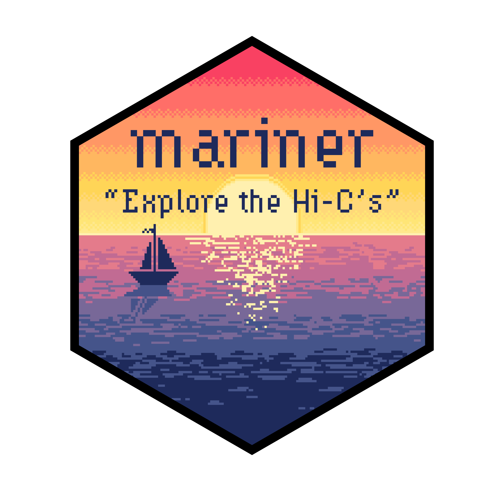

# Mariner: Explore the Hi-Cs 

<!-- badges: start -->

[](https://codecov.io/gh/EricSDavis/mariner)
[](https://zenodo.org/badge/latestdoi/475953890)
<!-- badges: end -->

## Why mariner?

Disruption or aberrant formation of chromatin interactions can result in
developmental abnormalities and disease. Therefore, deriving biological
insights from 3D chromatin structure experiments, such as Hi-C or Micro-C,
is essential for understanding and correcting human disease.

`mariner` is an R/Bioconductor package for exploring Hi-C data. It enables
users to flexibly manipulate, extract, and aggregate chromatin interaction
data quickly and efficiently.

<div class = "row">
<div class = "col-md-4">
<b>One ecosystem</b><br>
<code>mariner</code> extends common Bioconductor classes, leveraging the thousands of
existing tools for analyzing and visualizing genomic data.
</div>
  
<div class = "col-md-4">
<b>Modular design</b><br>
<code>mariner's</code> functions can be combined and chained in various ways to produce
custom workflows.
</div>
  
<div class = "col-md-4">
<b>Fast and efficient</b><br>
<code>mariner</code> leverages HDF5 to store large results and uses block processing
to minimize hardware requirements.
</div>
</div>

## Key features

<div class="row">
<div class="col-md-6" style="margin-bottom:20px; max-width:500px">
<b>Manipulating Paired Ranges</b><br>
<i>Convert, bin, and shift paired genomic ranges</i>
</img>
</div>
  
<div class="col-md-6" style="margin-bottom:20px; max-width:500px">
<b>Clustering & Merging Interactions</b><br>
<i>Group nearby interactions and select one as representative</i>
</img>
</div>
</div>
 
<div class="row">
<div class="col-md-6" style="margin-bottom:20px; max-width:500px">
<b>Extracting & Aggregating Interactions</b><br>
<i>Pull Hi-C pixels or matrices, then aggregate by files or interactions</i>
</img>
</div>

<div class="col-md-6" style="margin-bottom:20px; max-width:500px">
<b>Calculating Loop Enrichment</b><br>
<i>Determine loop enrichment to local background with
selection functions to flexibility select foreground
and background.</i>
</img>
</div>
</div>

## Installation

This package can be installed through Bioconductor:

```{r}
if (!require("BiocManager", quietly = TRUE))
    install.packages("BiocManager")
BiocManager::install("mariner")
```

Or the development version can be installed via GitHub:

```{r}
if (!requireNamespace("remotes", quietly = TRUE))
    install.packages("remotes")
remotes::install_github("EricSDavis/mariner")
```

## Contributing

This outlines how to propose a change to `mariner`. (Template adapted
from tidyverse contribution guide).

### Setting up the development environment

Every push to the `dev` or `main` branch of this repository builds
and pushes a development container to [dockerhub](https://hub.docker.com/r/ericsdavis/r-mariner) 
with `mariner` and its dependencies pre-installed. If you don't
have docker, follow the installation instructions at
https://www.docker.com/.
Follow the steps below to set up a reproducible development
environment:

1. In the terminal, clone this repository:

    ```{bash}
    git clone https://github.com/EricSDavis/mariner
    ```

2. Pull the latest image development image from dockerhub:

    ```{bash}
    docker pull ericsdavis/r-mariner
    ```

3. Run the container:

    ```{bash}
    docker run \
        --name mariner \
        -e PASSWORD=bioc \
        -p 8787:8787 \
        -v "$(pwd)/mariner:/home/rstudio/mariner" \
        ericsdavis/r-mariner:latest
    ```
    Then navigate to [localhost:8787](localhost:8787) and sign
    into RStudio with username=rstudio and password=bioc.

    Alternatively, this `docker-compose up` can be run with this
    `yaml` file:
        
    ```{yaml}
    services:
      mariner-devel:
        container_name: mariner-devel
        image: "ericsdavis/r-mariner"
        ports:
          - "8787:8787"
        environment:
          - PASSWORD=bioc
        volumes:
          - type: bind
            source: ./mariner
            target: /home/rstudio/mariner
    ```

### Fixing typos

You can fix typos, spelling mistakes, or grammatical errors in the
documentation directly using the GitHub web interface, as long as the
changes are made in the _source_ file.  This generally means you'll
need to edit [roxygen2
comments](https://roxygen2.r-lib.org/articles/roxygen2.html) in an
`.R`, not a `.Rd` file.  You can find the `.R` file that generates the
`.Rd` by reading the comment in the first line.

### Bigger changes

If you want to make a bigger change, it's a good idea to first file an
issue and make sure someone from the team agrees that it’s needed.  If
you’ve found a bug, please file an issue that illustrates the bug with
a minimal [reprex](https://www.tidyverse.org/help/#reprex) (this will
also help you write a unit test, if needed).

### Pull request process

*   Fork the package and clone onto your computer. If you haven't done
    this before, we recommend using
    `usethis::create_from_github("EricSDavis/mariner", fork = TRUE)`.

*   Install all development dependences with
    `devtools::install_dev_deps()`, and then make sure the package
    passes R CMD check by running `devtools::check()`.  If R CMD check
    doesn't pass cleanly, it's a good idea to ask for help before
    continuing.
*   Create a Git branch for your pull request (PR). We recommend using
    `usethis::pr_init("brief-description-of-change")`.

*   Make your changes, commit to git, and then create a PR by running
    `usethis::pr_push()`, and following the prompts in your browser.
    The title of your PR should briefly describe the change.  The body
    of your PR should contain `Fixes #issue-number`.

*  For user-facing changes, add a bullet to the top of `NEWS.md`
   (i.e. just below the first header). Follow the style described in
   <https://style.tidyverse.org/news.html>.

### Code style

*  We use [roxygen2](https://cran.r-project.org/package=roxygen2)
   for documentation.

*  We use [testthat](https://cran.r-project.org/package=testthat) for
   unit tests.
   Contributions with test cases included are easier to accept.

## Code of Conduct

Please note that the mariner project is released with a
[Contributor Code of Conduct](CODE_OF_CONDUCT.md). By contributing to
this project you agree to abide by its terms.
