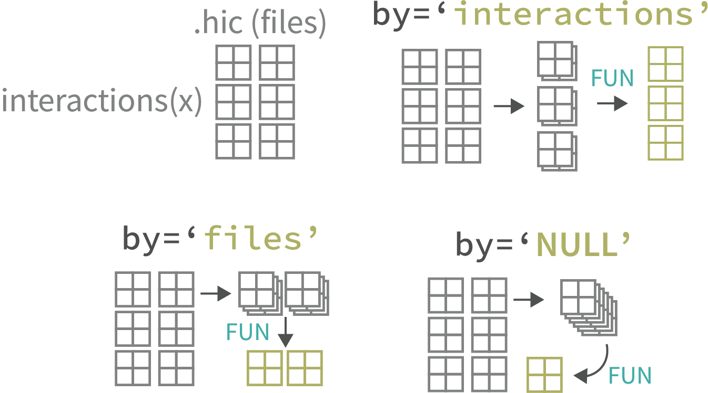

# Mariner: Explore the Hi-Cs 

<!-- badges: start -->

[](https://codecov.io/gh/EricSDavis/mariner?branch=dev)
[](https://zenodo.org/badge/latestdoi/475953890)
<!-- badges: end -->

## Why mariner?

Disruption or aberrant formation of chromatin interactions can result in
developmental abnormalities and disease. Therefore, deriving biological
insights from 3D chromatin structure experiments, such as Hi-C or Micro-C,
is essential for understanding and correcting human disease.

`mariner` is an R/Bioconductor package for exploring Hi-C data. It enables
users to flexibly manipulate, extract, and aggregate chromatin interaction
data quickly and efficiently.

<div class = "row">
<div class = "col-md-4">
**One ecosystem**<br>
`mariner` extends common Bioconductor classes, leveraging the thousands of
existing tools for analyzing and visualizing genomic data.
</div>
  
<div class = "col-md-4">
**Modular design**<br>
`mariner's` functions can be combined and chained in various ways to produce
custom workflows.
</div>
  
<div class = "col-md-4">
**Fast and efficient**<br>
`mariner` leverages HDF5 to store large results and uses block processing
to minimize hardware requirements.
</div>
</div>

## Key features

<div class="row">
<div class="col-md-6" style="margin-bottom:20px; max-width:500px">
**Manipulating Paired Ranges**<br>
<i>Convert, bin, and shift paired genomic ranges</i>
</img>
</div>
  
<div class="col-md-6" style="margin-bottom:20px; max-width:500px">
**Clustering & Merging Interactions**<br>
<i>Group nearby interactions and select one as representative</i>
</img>
</div>
</div>
 
<div class="row">
<div class="col-md-6" style="margin-bottom:20px; max-width:500px">
**Extracting & Aggregating Interactions**<br>
<i>Pull Hi-C pixels or matrices, then aggregate by files or interactions</i>
</img>
</div>

<div class="col-md-6" style="margin-bottom:20px; max-width:500px">
**Calculating Loop Enrichment**<br>
<i>Determine loop enrichment to local background with
selection functions to flexibility select foreground
and background.</i>
</img>
</div>
</div>

## Installation

This package can be installed via github:

```{r}
if (!requireNamespace("remotes", quietly = TRUE))
    install.packages("remotes")
remotes::install_github("EricSDavis/mariner")
```
