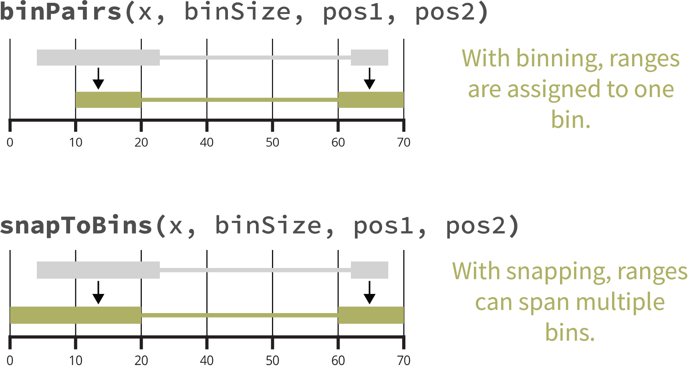

# Introduction to mariner

## Why mariner?

Disruption or aberrant formation of chromatin interactions can result in
developmental abnormalities and disease. Therefore, deriving biological
insights from 3D chromatin structure experiments, such as Hi-C or
Micro-C, is essential for understanding and correcting human disease.

`mariner` is an R/Bioconductor package for exploring 3D chromatin
structure data from Hi-C or Micro-C experiments. It enables users to
flexibly manipulate, extract, and aggregate chromatin interaction data
quickly and efficiently.

**One ecosystem**  
`mariner` extends common Bioconductor classes, leveraging the thousands
of existing tools for analyzing and visualizing genomic data.

**Modular design**  
`mariner's` functions can be combined and chained in various ways to
produce custom workflows.

**Fast and efficient**  
`mariner` leverages HDF5 to store large results and uses block
processing to minimize hardware requirements.

## Installation

This package can be installed through Bioconductor:

``` r
if (!require("BiocManager", quietly = TRUE))
    install.packages("BiocManager")
BiocManager::install("mariner")
```

Or the development version can be installed via GitHub:

``` r
if (!requireNamespace("remotes", quietly = TRUE))
    install.packages("remotes")
remotes::install_github("EricSDavis/mariner")
```

## Key features

### Manipulating Paired Ranges

`mariner` provides helpful functions for converting, binning, and
shifting paired genomic ranges.

#### Coercing to and accessing GInteractions

Pairwise interactions between genomic regions are represented in
Bioconductor with the `GInteractions` class from the `InteractionSet`
package. `mariner` provides additional utilities for converting
BEDPE-formatted data to `GInteractions` as well as accessing relevant
components of these objects.

``` r
library(mariner)
library(marinerData)

## BEDPE-formatted file
bedpeFile <- marinerData::WT_5kbLoops.txt()

## Read BEDPE
bedpe <- read.table(bedpeFile, header = TRUE)
head(bedpe)
```

    ##   chromosome1        x1        x2 chromosome2        y1        y2 color
    ## 1        chr9  14460000  14465000        chr9  14765000  14770000 0,0,0
    ## 2        chr9  89565000  89570000        chr9  89810000  89815000 0,0,0
    ## 3        chr9  23725000  23730000        chr9  23785000  23790000 0,0,0
    ## 4        chr9 128165000 128170000        chr9 128670000 128675000 0,0,0
    ## 5        chr9 113100000 113105000        chr9 113380000 113385000 0,0,0
    ## 6        chr9  16570000  16575000        chr9  16865000  16870000 0,0,0
    ##   APScoreAvg ProbabilityofEnrichment RegAPScoreAvg Avg_diffMaxNeihgboor_1
    ## 1   3.272132               0.9868535      2.233533              1.0059373
    ## 2   2.062756               0.9528638      1.326748              1.1275173
    ## 3   1.953737               0.9335626      1.408335              0.6212205
    ## 4   4.217386               0.9919898      2.144296              2.2130080
    ## 5   2.527488               0.9682012      1.470122              1.3876540
    ## 6   4.385120               0.9976317      2.230119              2.1201570
    ##   Avg_diffMaxNeihgboor_2      avg       std    value
    ## 1              1.6455076 3.437883 0.5164226 4.332049
    ## 2              1.1394584 2.052792 0.5861371 3.055030
    ## 3              0.8722256 2.159580 0.3773057 2.711776
    ## 4              2.6013327 2.860420 1.0796510 4.827538
    ## 5              1.5604625 2.215215 0.6669347 3.448685
    ## 6              3.5826060 4.161625 1.0922525 6.046209

``` r
## Coerce to GInteractions
gi <- as_ginteractions(bedpe, keep.extra.columns = FALSE)
gi
```

    ## GInteractions object with 12095 interactions and 0 metadata columns:
    ##           seqnames1             ranges1     seqnames2             ranges2
    ##               <Rle>           <IRanges>         <Rle>           <IRanges>
    ##       [1]      chr9   14460000-14465000 ---      chr9   14765000-14770000
    ##       [2]      chr9   89565000-89570000 ---      chr9   89810000-89815000
    ##       [3]      chr9   23725000-23730000 ---      chr9   23785000-23790000
    ##       [4]      chr9 128165000-128170000 ---      chr9 128670000-128675000
    ##       [5]      chr9 113100000-113105000 ---      chr9 113380000-113385000
    ##       ...       ...                 ... ...       ...                 ...
    ##   [12091]     chr17   16900000-16905000 ---     chr17   17095000-17100000
    ##   [12092]     chr17     7255000-7260000 ---     chr17     7470000-7475000
    ##   [12093]     chr17   46880000-46885000 ---     chr17   46955000-46960000
    ##   [12094]     chr17   17580000-17585000 ---     chr17   17695000-17700000
    ##   [12095]     chr17   47645000-47650000 ---     chr17   48075000-48080000
    ##   -------
    ##   regions: 20390 ranges and 0 metadata columns
    ##   seqinfo: 23 sequences from an unspecified genome; no seqlengths

`mariner` extends `InteractionSet`’s accessors, allowing users to
extract each component of interactions as vectors.

``` r
seqnames1(gi) |> head()
start1(gi) |> head()
end1(gi) |> head()
seqnames2(gi) |> head()
start2(gi) |> head()
end2(gi) |> head()
```

    ## [1] "chr9" "chr9" "chr9" "chr9" "chr9" "chr9"
    ## [1]  14460000  89565000  23725000 128165000 113100000  16570000
    ## [1]  14465000  89570000  23730000 128170000 113105000  16575000
    ## [1] "chr9" "chr9" "chr9" "chr9" "chr9" "chr9"
    ## [1]  14765000  89810000  23785000 128670000 113380000  16865000
    ## [1]  14770000  89815000  23790000 128675000 113385000  16870000

#### Assigning paired ranges to bins

Chromatin interaction data is usually binned at specific resolutions.
`mariner` provides helpful functions for assigning `GInteractions`
objects to differently sized bins.

``` r
## Assign to 1Kb bins
binned <- assignToBins(x=gi, binSize = 1e3, pos1='center', pos2='center')

## Show that each anchor is 1Kb
library(InteractionSet)
width(binned) |> lapply(unique)
```

    ## $first
    ## [1] 1001
    ## 
    ## $second
    ## [1] 1001

Note

`GenomicRanges` and `GInteractions` use ranges that are 1-based while
`.hic` are 0-based. For correct downstream processing with `.hic` files,
these functions put ranges into 0-based bins. This is why the `width`
function returns `binSize + 1`.

This function also allows each pair, or anchor, to be binned separately
and from different reference points (e.g. `pos1` and `pos2`).

``` r
## Assign anchor1 to 1Kb bins and anchor2 to 25Kb bins
binned <- assignToBins(x=gi, binSize=c(1e3, 25e3), pos1="start", pos2="center")

## Show that the first anchor is 1Kb and
## second anchor is 25Kb
width(binned) |> lapply(unique)
```

    ## $first
    ## [1] 1001
    ## 
    ## $second
    ## [1] 25001

While
[`assignToBins()`](http://ericscottdavis.com/mariner/reference/assignToBins.md)
assigns each pair of ranges to a single bin, the
[`snapToBins()`](http://ericscottdavis.com/mariner/reference/snapToBins.md)
function assigns the starts and ends of the ranges to their nearest bin.
This allows each anchor to span multiple bins.

``` r
## Create an example GInteractions object
gi <- GInteractions(
    anchor1 = c(
        GRanges("chr1:1-15"),
        GRanges("chr1:1-11")
    ),
    anchor2 = c(
        GRanges("chr1:25-31"),
        GRanges("chr1:19-31")
    )
)

## Original interactions
gi

## Snap to bins with different binSizes
snapToBins(x=gi, binSize=5)
snapToBins(x=gi, binSize=10)
```

    ## GInteractions object with 2 interactions and 0 metadata columns:
    ##       seqnames1   ranges1     seqnames2   ranges2
    ##           <Rle> <IRanges>         <Rle> <IRanges>
    ##   [1]      chr1      1-15 ---      chr1     25-31
    ##   [2]      chr1      1-11 ---      chr1     19-31
    ##   -------
    ##   regions: 4 ranges and 0 metadata columns
    ##   seqinfo: 1 sequence from an unspecified genome; no seqlengths
    ## GInteractions object with 2 interactions and 0 metadata columns:
    ##       seqnames1   ranges1     seqnames2   ranges2
    ##           <Rle> <IRanges>         <Rle> <IRanges>
    ##   [1]      chr1      0-15 ---      chr1     25-30
    ##   [2]      chr1      0-10 ---      chr1     20-30
    ##   -------
    ##   regions: 4 ranges and 0 metadata columns
    ##   seqinfo: 1 sequence from an unspecified genome; no seqlengths
    ## GInteractions object with 2 interactions and 0 metadata columns:
    ##       seqnames1   ranges1     seqnames2   ranges2
    ##           <Rle> <IRanges>         <Rle> <IRanges>
    ##   [1]      chr1      0-20 ---      chr1     20-30
    ##   [2]      chr1      0-10 ---      chr1     20-30
    ##   -------
    ##   regions: 3 ranges and 0 metadata columns
    ##   seqinfo: 1 sequence from an unspecified genome; no seqlengths

The following figure summarizes the differences between binning and
snapping.



### Clustering & Merging Interactions

Group nearby interactions and select one as representative.

When combining BEDPE files, it is often important to recognize and
reduce duplicate or near duplicate interactions.
[`mergePairs()`](http://ericscottdavis.com/mariner/reference/mergePairs.md)
allows users to cluster interactions within a specified genomic radius
and select a representative interaction for the group.

This is particularly helpful in analysis of chromatin loop where
multiple Hi-C replicates often identify the same loop but assign it to a
different (but often neighboring) pixel. To avoid redundancy,
[`mergePairs()`](http://ericscottdavis.com/mariner/reference/mergePairs.md)
identifies and merges these into a unified non-redundant loop set.

Here, two example BEDPE files are imported as a list of `GInteractions`
objects.

``` r
library(mariner)
library(marinerData)

## BEDPE-formatted files
bedpeFiles <- c(
    marinerData::FS_5kbLoops.txt(),
    marinerData::WT_5kbLoops.txt()
)
names(bedpeFiles) <- c("FS", "WT")

## Read as list of GInteractions
giList <-
    lapply(bedpeFiles, read.table, header=TRUE) |>
    lapply(as_ginteractions)

lapply(giList, summary)
```

    ## $FS
    ## [1] "GInteractions object of length 8566 with 9 metadata columns"
    ## 
    ## $WT
    ## [1] "GInteractions object of length 12095 with 9 metadata columns"

Then cluster and merge with
[`mergePairs()`](http://ericscottdavis.com/mariner/reference/mergePairs.md).

``` r
mgi <- mergePairs(
    x=giList,
    radius=10e3
)
mgi
```

    ## MergedGInteractions object with 16716 interactions and 0 metadata columns:
    ##           seqnames1             ranges1     seqnames2             ranges2
    ##               <Rle>           <IRanges>         <Rle>           <IRanges>
    ##       [1]      chr9 118645000-118650000 ---      chr9 119330000-119335000
    ##       [2]      chr9   15280000-15285000 ---      chr9   15405000-15410000
    ##       [3]      chr9 110180000-110185000 ---      chr9 111520000-111525000
    ##       [4]      chr9   80375000-80380000 ---      chr9   80650000-80655000
    ##       [5]      chr9 108380000-108385000 ---      chr9 108475000-108480000
    ##       ...       ...                 ... ...       ...                 ...
    ##   [16712]     chr17   71422500-71427500 ---     chr17   72170000-72175000
    ##   [16713]     chr17   28450000-28455000 ---     chr17   28657500-28662500
    ##   [16714]     chr17   65375000-65380000 ---     chr17   65685000-65690000
    ##   [16715]     chr17   77712500-77717500 ---     chr17   77965000-77970000
    ##   [16716]     chr17   46880000-46885000 ---     chr17   46955000-46960000
    ##   -------
    ##   regions: 28189 ranges and 0 metadata columns
    ##   seqinfo: 23 sequences from an unspecified genome; no seqlengths

Note

The metadata is missing from these interactions. Since no `column` was
provided, each interaction may be an average of one or more interaction.
The user can decide how metadata from each cluster should be aggregated
with
[`aggMetadata()`](http://ericscottdavis.com/mariner/reference/aggMetadata.md).

The resulting object is `MergedGInteractions` class, where each of these
interactions is a representative cluster of one or more interactions.
This class behaves like `GInteractions` but contains additional
information about the clustered interactions.

To view the clusters of specific interactions, use the
[`clusters()`](http://ericscottdavis.com/mariner/reference/clusters.md)
accessor.

``` r
mgi[12772]
clusters(mgi[12772])
```

    ## MergedGInteractions object with 1 interaction and 0 metadata columns:
    ##       seqnames1           ranges1     seqnames2           ranges2
    ##           <Rle>         <IRanges>         <Rle>         <IRanges>
    ##   [1]      chr9 90302500-90307500 ---      chr9 90430000-90435000
    ##   -------
    ##   regions: 28189 ranges and 0 metadata columns
    ##   seqinfo: 23 sequences from an unspecified genome; no seqlengths
    ## [[1]]
    ##    seqnames1   start1     end1 width1 strand1 seqnames2   start2     end2
    ##       <fctr>    <int>    <int>  <int>  <fctr>    <fctr>    <int>    <int>
    ## 1:      chr9 90300000 90305000   5001       *      chr9 90430000 90435000
    ## 2:      chr9 90305000 90310000   5001       *      chr9 90430000 90435000
    ##    width2 strand2  color APScoreAvg ProbabilityofEnrichment RegAPScoreAvg
    ##     <int>  <fctr> <char>      <num>                   <num>         <num>
    ## 1:   5001       *  0,0,0   2.543816               0.9444922      1.887968
    ## 2:   5001       *  0,0,0   2.718088               0.9531689      1.922928
    ##    Avg_diffMaxNeihgboor_1 Avg_diffMaxNeihgboor_2      avg       std    value
    ##                     <num>                  <num>    <num>     <num>    <num>
    ## 1:              0.7340446              0.7978164 2.239048 0.4049837 2.891532
    ## 2:              0.7962394              1.0013034 2.353757 0.5259836 3.061525
    ##       src
    ##    <char>
    ## 1:     FS
    ## 2:     WT

When no `column` argument is provided the most frequently occurring
interaction is selected. In the pair above, the mean position of both
anchors is returned since neither is more frequent.

Alternatively, users can specify the `column` argument to use a custom
metric for selecting a representative interaction.

``` r
mgi <- mergePairs(
    x=giList,
    radius=10e3,
    column="APScoreAvg",
    selectMax=TRUE
)
mgi
```

    ## MergedGInteractions object with 16716 interactions and 9 metadata columns:
    ##           seqnames1             ranges1     seqnames2             ranges2 |
    ##               <Rle>           <IRanges>         <Rle>           <IRanges> |
    ##       [1]      chr9 118645000-118650000 ---      chr9 119330000-119335000 |
    ##       [2]      chr9   15280000-15285000 ---      chr9   15405000-15410000 |
    ##       [3]      chr9 110180000-110185000 ---      chr9 111520000-111525000 |
    ##       [4]      chr9   80375000-80380000 ---      chr9   80650000-80655000 |
    ##       [5]      chr9 108380000-108385000 ---      chr9 108475000-108480000 |
    ##       ...       ...                 ... ...       ...                 ... .
    ##   [16712]     chr17   71425000-71430000 ---     chr17   72170000-72175000 |
    ##   [16713]     chr17   28450000-28455000 ---     chr17   28660000-28665000 |
    ##   [16714]     chr17   65375000-65380000 ---     chr17   65685000-65690000 |
    ##   [16715]     chr17   77710000-77715000 ---     chr17   77965000-77970000 |
    ##   [16716]     chr17   46880000-46885000 ---     chr17   46955000-46960000 |
    ##                 color APScoreAvg ProbabilityofEnrichment RegAPScoreAvg
    ##           <character>  <numeric>               <numeric>     <numeric>
    ##       [1]       0,0,0    2.61103                0.986044       1.41438
    ##       [2]       0,0,0    2.45301                0.982802       1.54370
    ##       [3]       0,0,0    3.40635                0.996545       1.80221
    ##       [4]       0,0,0    2.09352                0.946897       1.40194
    ##       [5]       0,0,0    2.14182                0.936547       1.41005
    ##       ...         ...        ...                     ...           ...
    ##   [16712]       0,0,0    4.05887                0.997252       2.12187
    ##   [16713]       0,0,0    4.47565                0.995379       2.49118
    ##   [16714]       0,0,0    3.91395                0.996974       2.83091
    ##   [16715]       0,0,0    3.39028                0.979869       2.42961
    ##   [16716]       0,0,0    3.89043                0.982768       2.73390
    ##           Avg_diffMaxNeihgboor_1 Avg_diffMaxNeihgboor_2       avg       std
    ##                        <numeric>              <numeric> <numeric> <numeric>
    ##       [1]               1.875585                2.12164   2.60512  0.794220
    ##       [2]               1.491568                1.60777   2.73756  0.856876
    ##       [3]               3.768934                3.89112   4.49898  1.492786
    ##       [4]               0.818514                1.10611   2.20826  0.589976
    ##       [5]               0.907892                1.01824   1.95072  0.543293
    ##       ...                    ...                    ...       ...       ...
    ##   [16712]               2.484298                3.15533   3.68911  1.144096
    ##   [16713]               2.181075                2.63508   3.43889  0.827104
    ##   [16714]               1.091847                1.96232   4.83071  0.753955
    ##   [16715]               1.139229                1.15973   2.89326  0.589743
    ##   [16716]               0.906871                1.43305   3.25531  0.368257
    ##               value
    ##           <numeric>
    ##       [1]   4.27231
    ##       [2]   4.06339
    ##       [3]   7.84915
    ##       [4]   2.93583
    ##       [5]   2.75773
    ##       ...       ...
    ##   [16712]   5.89737
    ##   [16713]   5.37762
    ##   [16714]   5.80124
    ##   [16715]   3.90591
    ##   [16716]   4.06142
    ##   -------
    ##   regions: 27152 ranges and 0 metadata columns
    ##   seqinfo: 23 sequences from an unspecified genome; no seqlengths

The interaction with the higher value (`selectMax=TRUE`) for
“APScoreAvg” has been selected.

``` r
mgi[12772]
clusters(mgi[12772])
```

    ## MergedGInteractions object with 1 interaction and 9 metadata columns:
    ##       seqnames1           ranges1     seqnames2           ranges2 |       color
    ##           <Rle>         <IRanges>         <Rle>         <IRanges> | <character>
    ##   [1]      chr9 90305000-90310000 ---      chr9 90430000-90435000 |       0,0,0
    ##       APScoreAvg ProbabilityofEnrichment RegAPScoreAvg Avg_diffMaxNeihgboor_1
    ##        <numeric>               <numeric>     <numeric>              <numeric>
    ##   [1]    2.71809                0.953169       1.92293               0.796239
    ##       Avg_diffMaxNeihgboor_2       avg       std     value
    ##                    <numeric> <numeric> <numeric> <numeric>
    ##   [1]                 1.0013   2.35376  0.525984   3.06153
    ##   -------
    ##   regions: 27152 ranges and 0 metadata columns
    ##   seqinfo: 23 sequences from an unspecified genome; no seqlengths
    ## [[1]]
    ##    seqnames1   start1     end1 width1 strand1 seqnames2   start2     end2
    ##       <fctr>    <int>    <int>  <int>  <fctr>    <fctr>    <int>    <int>
    ## 1:      chr9 90300000 90305000   5001       *      chr9 90430000 90435000
    ## 2:      chr9 90305000 90310000   5001       *      chr9 90430000 90435000
    ##    width2 strand2  color APScoreAvg ProbabilityofEnrichment RegAPScoreAvg
    ##     <int>  <fctr> <char>      <num>                   <num>         <num>
    ## 1:   5001       *  0,0,0   2.543816               0.9444922      1.887968
    ## 2:   5001       *  0,0,0   2.718088               0.9531689      1.922928
    ##    Avg_diffMaxNeihgboor_1 Avg_diffMaxNeihgboor_2      avg       std    value
    ##                     <num>                  <num>    <num>     <num>    <num>
    ## 1:              0.7340446              0.7978164 2.239048 0.4049837 2.891532
    ## 2:              0.7962394              1.0013034 2.353757 0.5259836 3.061525
    ##       src
    ##    <char>
    ## 1:     FS
    ## 2:     WT

The [`sets()`](http://ericscottdavis.com/mariner/reference/sets.md)
accessor allows users to find which interactions are shared or exclusive
between sets of interactions in the giList.

``` r
## List the input sources
sources(mgi)
```

    ## [1] "FS" "WT"

``` r
## Interactions unique to each source
sets(mgi) |> lapply(summary)
```

    ## $FS
    ## [1] "MergedGInteractions object of length 4621 with 9 metadata columns"
    ## 
    ## $WT
    ## [1] "MergedGInteractions object of length 8150 with 9 metadata columns"
    ## 
    ## $FS_WT
    ## [1] "MergedGInteractions object of length 3945 with 9 metadata columns"

``` r
## Interactions shared by both sources
sets(x=mgi, include=sources(mgi))
```

    ## MergedGInteractions object with 3945 interactions and 9 metadata columns:
    ##          seqnames1             ranges1     seqnames2             ranges2 |
    ##              <Rle>           <IRanges>         <Rle>           <IRanges> |
    ##      [1]      chr9   90305000-90310000 ---      chr9   90430000-90435000 |
    ##      [2]      chr9   17810000-17815000 ---      chr9   18210000-18215000 |
    ##      [3]      chr9   14615000-14620000 ---      chr9   14765000-14770000 |
    ##      [4]      chr9 123640000-123645000 ---      chr9 123690000-123695000 |
    ##      [5]      chr9 116350000-116355000 ---      chr9 116415000-116420000 |
    ##      ...       ...                 ... ...       ...                 ... .
    ##   [3941]     chr17   71425000-71430000 ---     chr17   72170000-72175000 |
    ##   [3942]     chr17   28450000-28455000 ---     chr17   28660000-28665000 |
    ##   [3943]     chr17   65375000-65380000 ---     chr17   65685000-65690000 |
    ##   [3944]     chr17   77710000-77715000 ---     chr17   77965000-77970000 |
    ##   [3945]     chr17   46880000-46885000 ---     chr17   46955000-46960000 |
    ##                color APScoreAvg ProbabilityofEnrichment RegAPScoreAvg
    ##          <character>  <numeric>               <numeric>     <numeric>
    ##      [1]       0,0,0    2.71809                0.953169       1.92293
    ##      [2]       0,0,0    6.67809                0.999825       3.09492
    ##      [3]       0,0,0    4.03621                0.990983       1.88137
    ##      [4]       0,0,0    1.80119                0.915252       1.30425
    ##      [5]       0,0,0    3.98045                0.993344       2.34677
    ##      ...         ...        ...                     ...           ...
    ##   [3941]       0,0,0    4.05887                0.997252       2.12187
    ##   [3942]       0,0,0    4.47565                0.995379       2.49118
    ##   [3943]       0,0,0    3.91395                0.996974       2.83091
    ##   [3944]       0,0,0    3.39028                0.979869       2.42961
    ##   [3945]       0,0,0    3.89043                0.982768       2.73390
    ##          Avg_diffMaxNeihgboor_1 Avg_diffMaxNeihgboor_2       avg       std
    ##                       <numeric>              <numeric> <numeric> <numeric>
    ##      [1]               0.796239               1.001303   2.35376  0.525984
    ##      [2]               4.171168               5.166137   4.94208  1.538564
    ##      [3]               1.987963               2.934255   2.94201  0.802044
    ##      [4]               0.674690               0.726729   1.86861  0.317171
    ##      [5]               1.527367               2.450921   3.65504  0.677612
    ##      ...                    ...                    ...       ...       ...
    ##   [3941]               2.484298                3.15533   3.68911  1.144096
    ##   [3942]               2.181075                2.63508   3.43889  0.827104
    ##   [3943]               1.091847                1.96232   4.83071  0.753955
    ##   [3944]               1.139229                1.15973   2.89326  0.589743
    ##   [3945]               0.906871                1.43305   3.25531  0.368257
    ##              value
    ##          <numeric>
    ##      [1]   3.06153
    ##      [2]   8.64979
    ##      [3]   4.70909
    ##      [4]   2.46833
    ##      [5]   5.01270
    ##      ...       ...
    ##   [3941]   5.89737
    ##   [3942]   5.37762
    ##   [3943]   5.80124
    ##   [3944]   3.90591
    ##   [3945]   4.06142
    ##   -------
    ##   regions: 27152 ranges and 0 metadata columns
    ##   seqinfo: 23 sequences from an unspecified genome; no seqlengths

This is particularly useful for identifying *de novo*, shared or
transient interactions. For more information see `?sets()`.

### Extracting & Aggregating Interactions

Pull Hi-C pixels or matrices, then aggregate by files or interactions.

`mariner` provides two functions for extracting contacts from `.hic`
files,
[`pullHicPixels()`](http://ericscottdavis.com/mariner/reference/pullHicPixels.md)
and
[`pullHicMatrices()`](http://ericscottdavis.com/mariner/reference/pullHicMatrices.md),
which use the `binSize` argument to determine how the data should be
returned. In short,
[`pullHicPixels()`](http://ericscottdavis.com/mariner/reference/pullHicPixels.md)
returns a matrix of contact frequency for each interaction and `.hic`
file, while
[`pullHicMatrices()`](http://ericscottdavis.com/mariner/reference/pullHicMatrices.md)
returns an array of contact matrices. The following sections describe
when and how to use each of these functions.

#### Pulling pixels

Pixels are defined as paired-ranges with widths equal to their
`binSize`. When all interactions are pixels,
[`pullHicPixels()`](http://ericscottdavis.com/mariner/reference/pullHicPixels.md)
returns an `InteractionMatrix` object containing a matrix of contact
frequency for each interaction (row) and `.hic` file (column).

As described in previous sections, BEDPE files containing the locations
of chromatin loops can be read in and merged.

``` r
library(mariner)
library(marinerData)

## BEDPE-formatted files
bedpeFiles <- c(
    marinerData::FS_5kbLoops.txt(),
    marinerData::WT_5kbLoops.txt()
)
names(bedpeFiles) <- c("FS", "WT")

## Read as list of GInteractions
giList <-
    lapply(bedpeFiles, read.table, header=TRUE) |>
    lapply(as_ginteractions)

## Merge
mgi <- mergePairs(x=giList, radius=10e3, column="APScoreAvg")

summary(mgi)
```

    ## [1] "MergedGInteractions object of length 16716 with 9 metadata columns"

The `marinerData` `ExperimentHub` package includes some small `.hic`
files that can be downloaded for testing.

``` r
library(marinerData)
hicFiles <- c(
    LEUK_HEK_PJA27_inter_30.hic(),
    LEUK_HEK_PJA30_inter_30.hic()
)
names(hicFiles) <- c("FS", "WT")
hicFiles
```

    ##                                                      FS 
    ## "/home/runner/.cache/R/ExperimentHub/7b5756449908_8147" 
    ##                                                      WT 
    ## "/home/runner/.cache/R/ExperimentHub/7b575c1774a3_8148"

The `strawr` package includes functions for visualizing the available
chromosomes, resolutions (`binSizes`), and normalizations in the `.hic`
files.

``` r
library(strawr)

## Normalizations
lapply(hicFiles, readHicNormTypes)
```

    ## $FS
    ## [1] "NONE"    "VC_SQRT" "VC"      "KR"     
    ## 
    ## $WT
    ## [1] "NONE"    "VC_SQRT" "VC"      "KR"

``` r
## Resolutions
lapply(hicFiles, readHicBpResolutions)
```

    ## $FS
    ## [1] 2500000 1000000  500000  250000  100000   50000   25000   10000    5000
    ## 
    ## $WT
    ## [1] 2500000 1000000  500000  250000  100000   50000   25000   10000    5000

``` r
## Chromosomes
lapply(hicFiles, readHicChroms) |>
    lapply(head)
```

    ## $FS
    ##   index              name    length
    ## 1     1                 1 248956422
    ## 2    12                10 133797422
    ## 3   174 10_GL383545V1_ALT    179254
    ## 4    79 10_GL383546V1_ALT    309802
    ## 5   168 10_KI270824V1_ALT    181496
    ## 6   150 10_KI270825V1_ALT    188315
    ## 
    ## $WT
    ##   index              name    length
    ## 1     1                 1 248956422
    ## 2    12                10 133797422
    ## 3   174 10_GL383545V1_ALT    179254
    ## 4    79 10_GL383546V1_ALT    309802
    ## 5   168 10_KI270824V1_ALT    181496
    ## 6   150 10_KI270825V1_ALT    188315

Since the chromosomes in the `.hic` files have been processed without
the “chr” prefix, it is important to change the `seqLevelsStyle` of the
interactions to match.

``` r
GenomeInfoDb::seqlevelsStyle(mgi) <- 'ENSEMBL'
```

These interactions can then be binned to the desired resolution with the
[`assignToBins()`](http://ericscottdavis.com/mariner/reference/assignToBins.md)
function.

``` r
## Assign interactions to 100Kb bins
binned <- assignToBins(x=mgi, binSize=100e3)
```

Contact frequency can then be extracted with
[`pullHicPixels()`](http://ericscottdavis.com/mariner/reference/pullHicPixels.md).
Here only the first 1000 pixels are pulled for demonstration purposes.

``` r
imat <- pullHicPixels(
    x=binned[1:1000],
    files=hicFiles,
    binSize=100e3
)
imat
```

    ## class: InteractionMatrix 
    ## dim: count matrix with 1000 interactions and 2 file(s)
    ## metadata(3): binSize norm matrix
    ## assays(1): counts
    ## rownames: NULL
    ## rowData names(9): color APScoreAvg ... std value
    ## colnames(2): FS WT
    ## colData names(2): files fileNames
    ## type: MergedGInteractions
    ## regions: 13923

Note

There are many parameters in the
[`pullHicPixels()`](http://ericscottdavis.com/mariner/reference/pullHicPixels.md)
function. Users can change the normalization, the type of matrix pulled
(e.g. “observed” vs “expected”), and where/how the on-disk data is
stored. Users can also decrease the amount of data read into memory by
decreasing the `blockSize`. For more information see `?pullHicPixels()`
or `?pullHicMatrices()`.

The count matrix can be extracted from the `InteractionMatrix` class
with the [`counts()`](https://rdrr.io/pkg/BiocGenerics/man/dge.html)
function.

``` r
counts(imat)
```

    ## <1000 x 2> DelayedMatrix object of type "double":
    ##         FS WT
    ##    [1,]  4  1
    ##    [2,]  8  5
    ##    [3,]  3  2
    ##    [4,]  3  3
    ##    [5,] 14  8
    ##     ...  .  .
    ##  [996,]  6 10
    ##  [997,]  5  4
    ##  [998,]  0  0
    ##  [999,] 11  5
    ## [1000,]  0  0

Note

The `InteractionMatrix` class extends `InteractionSet` and
`SummarizedExperiment` classes. See the documentation for these classes
for instructions on how to extract different parts of the
`InteractionMatrix` object.

#### Pulling submatrices

When the widths of paired-ranges are greater than the `binSize`,
[`pullHicMatrices()`](http://ericscottdavis.com/mariner/reference/pullHicMatrices.md)
returns an `InteractionArray` object containing an array of contact
matrices for each interaction and `.hic` file.

Using the example above, reducing the `binSize` to 25Kb when the data is
binned at 100Kb results in 4x4 count matrices for each interaction
instead of a single value.

``` r
iarr <- pullHicMatrices(
    x=binned[1:1000],
    file=hicFiles,
    binSize = 25e3
)
iarr
```

    ## class: InteractionArray 
    ## dim: 1000 interaction(s), 2 file(s), 4x4 count matrix(es)
    ## metadata(3): binSize norm matrix
    ## assays(3): counts rownames colnames
    ## rownames: NULL
    ## rowData names(9): color APScoreAvg ... std value
    ## colnames(2): FS WT
    ## colData names(2): files fileNames
    ## type: MergedGInteractions
    ## regions: 13923

This results in an `InteractionArray` with 1000 interactions, each with
4x4 count matrices across 2 `.hic` files. These data can be accessed
with the same
[`counts()`](https://rdrr.io/pkg/BiocGenerics/man/dge.html) accessor.

``` r
counts(iarr)
```

    ## <4 x 4 x 1000 x 2> DelayedArray object of type "double":
    ## ,,1,FS
    ##      [,1] [,2] [,3] [,4]
    ## [1,]    0    0    0    0
    ## [2,]    0    0    0    1
    ## [3,]    0    1    0    1
    ## [4,]    0    1    0    0
    ## 
    ## ...
    ## 
    ## ,,1000,WT
    ##      [,1] [,2] [,3] [,4]
    ## [1,]    0    0    0    0
    ## [2,]    0    0    0    0
    ## [3,]    0    0    0    0
    ## [4,]    0    0    0    0

The start bins for each interaction can be shown by setting
`showDimnames=TRUE`.

``` r
counts(iarr, showDimnames=TRUE)
```

    ## <4 x 4 x 1000 x 2> DelayedArray object of type "double":
    ## ,,1,FS
    ##           119300000 119325000 119350000 119375000
    ## 118600000         0         0         0         0
    ## 118625000         0         0         0         1
    ## 118650000         0         1         0         1
    ## 118675000         0         1         0         0
    ## 
    ## ...
    ## 
    ## ,,1000,WT
    ##           108700000 108725000 108750000 108775000
    ## 107900000         0         0         0         0
    ## 107925000         0         0         0         0
    ## 107950000         0         0         0         0
    ## 107975000         0         0         0         0

Note

These functions utilize the `DelayedArray` and `HDF5Array` framework to
efficiently store extracted data on-disk, freeing up RAM, and allowing
users to work with large contact data seamlessly.

The
[`pixelsToMatrices()`](http://ericscottdavis.com/mariner/reference/pixelsToMatrices.md)
function helps prepare regions surrounding a central pixel. For example,
the code below shows how to pull 3x3 matrices surrounding a 100Kb pixel.

``` r
## Define region with 1-pixel buffer
regions <- pixelsToMatrices(x=binned[1:1000], buffer=1)

## Pull 3x3 matrices from 1000 interactions and 2 hic files
iarr <- pullHicMatrices(
    x=regions,
    files=hicFiles,
    binSize=100e3
)

## See count matrices
counts(iarr)
```

    ## <3 x 3 x 1000 x 2> DelayedArray object of type "double":
    ## ,,1,FS
    ##      [,1] [,2] [,3]
    ## [1,]    1    3    2
    ## [2,]    1    4    4
    ## [3,]    3    0    4
    ## 
    ## ,,2,FS
    ##      [,1] [,2] [,3]
    ## [1,]    3    4    3
    ## [2,]   11    8    2
    ## [3,]   40    8    5
    ## 
    ## ,,3,FS
    ##      [,1] [,2] [,3]
    ## [1,]    0    1    1
    ## [2,]    1    3    0
    ## [3,]    2    2    2
    ## 
    ## ...
    ## 
    ## ,,998,WT
    ##      [,1] [,2] [,3]
    ## [1,]    0    1    1
    ## [2,]    0    0    0
    ## [3,]    2    1    2
    ## 
    ## ,,999,WT
    ##      [,1] [,2] [,3]
    ## [1,]    8    3    2
    ## [2,]   13    5    2
    ## [3,]   42   10    5
    ## 
    ## ,,1000,WT
    ##      [,1] [,2] [,3]
    ## [1,]    3    0    0
    ## [2,]    0    0    0
    ## [3,]    0    1    2

This also works on rectangular selections.

``` r
## Bin at two different resolutions
binned <- assignToBins(x=mgi, binSize=c(100e3, 250e3))

## Pull 10x25 matrices from 1000 interactions and 2 hic files
iarr2 <- pullHicMatrices(
    x=binned[1:1000],
    files=hicFiles,
    binSize=10e3
)

## See count matrices
counts(iarr2)
```

    ## <10 x 25 x 1000 x 2> DelayedArray object of type "double":
    ## ,,1,FS
    ##        [,1]  [,2]  [,3] ... [,24] [,25]
    ##  [1,]     0     0     0   .     0     0
    ##  [2,]     0     0     0   .     0     0
    ##   ...     .     .     .   .     .     .
    ##  [9,]     0     0     0   .     0     0
    ## [10,]     0     0     0   .     0     0
    ## 
    ## ...
    ## 
    ## ,,1000,WT
    ##        [,1]  [,2]  [,3] ... [,24] [,25]
    ##  [1,]     0     0     0   .     0     0
    ##  [2,]     0     0     0   .     0     0
    ##   ...     .     .     .   .     .     .
    ##  [9,]     0     0     0   .     0     0
    ## [10,]     0     0     0   .     0     0

#### Aggregating count matrices

The
[`aggHicMatrices()`](http://ericscottdavis.com/mariner/reference/aggHicMatrices.md)
function allows flexible aggregation of `InteractionArray` objects by
interactions, Hi-C files, or both (default). The `FUN` argument controls
how these contacts should be aggregated (the default is `sum`).

``` r
## One matrix per interaction
aggHicMatrices(x=iarr, by="interactions")
```

    ## / Reading and realizing block 1/5 ... OK
    ## \ Processing it ... OK
    ## / Reading and realizing block 2/5 ... OK
    ## \ Processing it ... OK
    ## / Reading and realizing block 3/5 ... OK
    ## \ Processing it ... OK
    ## / Reading and realizing block 4/5 ... OK
    ## \ Processing it ... OK
    ## / Reading and realizing block 5/5 ... OK
    ## \ Processing it ... OK

    ## <3 x 3 x 1000> DelayedArray object of type "double":
    ## ,,1
    ##      [,1] [,2] [,3]
    ## [1,]    1    4    2
    ## [2,]    4    5    7
    ## [3,]    4    3    6
    ## 
    ## ,,2
    ##      [,1] [,2] [,3]
    ## [1,]    7    5    7
    ## [2,]   15   13    3
    ## [3,]   63   19    9
    ## 
    ## ,,3
    ##      [,1] [,2] [,3]
    ## [1,]    1    1    2
    ## [2,]    4    5    2
    ## [3,]    3    6    2
    ## 
    ## ...
    ## 
    ## ,,998
    ##      [,1] [,2] [,3]
    ## [1,]    0    1    2
    ## [2,]    1    0    0
    ## [3,]    5    2    3
    ## 
    ## ,,999
    ##      [,1] [,2] [,3]
    ## [1,]   18    8    7
    ## [2,]   29   16    5
    ## [3,]   97   31    9
    ## 
    ## ,,1000
    ##      [,1] [,2] [,3]
    ## [1,]    4    1    2
    ## [2,]    1    0    1
    ## [3,]    3    2    2

``` r
## One matrix per file
aggHicMatrices(x=iarr, by="files")
```

    ## <3 x 3 x 2> DelayedArray object of type "double":
    ## ,,FS
    ##       [,1]  [,2]  [,3]
    ## [1,]  6803  3789  2709
    ## [2,] 11212  6874  3776
    ## [3,] 13871 11029  6562
    ## 
    ## ,,WT
    ##       [,1]  [,2]  [,3]
    ## [1,]  5645  3180  2240
    ## [2,]  8964  5678  2996
    ## [3,] 11282  9085  5614

``` r
## One matrix total
aggHicMatrices(x=iarr)
```

    ## <3 x 3> DelayedMatrix object of type "double":
    ##       [,1]  [,2]  [,3]
    ## [1,] 12448  6969  4949
    ## [2,] 20176 12552  6772
    ## [3,] 25153 20114 12176

Note

The
[`aggHicMatrices()`](http://ericscottdavis.com/mariner/reference/aggHicMatrices.md)
function uses block processing to operate on the `DelayedArray` count
matrices. The `nBlocks` argument controls how many blocks the data
should be split into for processing. This can be conducted in parallel
by setting `BPPARAM`. See `?aggHicMatrices()` for more information.

#### Visualizing aggregated matrices

`mariner` provides the
[`plotMatrix()`](http://ericscottdavis.com/mariner/reference/plotMatrix.md)
function for visualizing the aggregated `.hic` matrices, such as in an
aggregate peak analysis.

``` r
mat <- aggHicMatrices(x=iarr)
plotMatrix(data=mat)
```


    ## MatrixPlot[MatrixPlot1]

This function is compatible with `plotgardener`, an R/Bioconductor
genomic visualization package. `plotgardener` gives precise control over
the size and placement of plots on a page, making it suitable for
complex, publication-ready figure building. For more information about
`plotgardener` visit <https://phanstiellab.github.io/plotgardener/>.

### Calculating Loop Enrichment

Determine loop enrichment to local background with *selection functions*
to flexibility select foreground and background.

The
[`calcLoopEnrichment()`](http://ericscottdavis.com/mariner/reference/calcLoopEnrichment.md)
function combines many of the steps described in the previous sections
into a single function that pulls Hi-C pixels and calculates the
enrichment of a selected *foreground* compared to a selected
*background*.

`mariner` provides several different selection functions for easily and
flexibly selecting different parts of a matrix. The code below shows a
few examples of how these functions can be used and combined to select
virtually any part of a square matrix.

``` r
## Define the buffer
buffer <- 3

## Select center pixel
selectCenterPixel(mhDist=0, buffer=buffer)
```

    ## '0' = selected; '-' = unselected
    ##                      
    ##  -  -  -  -  -  -  - 
    ##  -  -  -  -  -  -  - 
    ##  -  -  -  -  -  -  - 
    ##  -  -  -  0  -  -  - 
    ##  -  -  -  -  -  -  - 
    ##  -  -  -  -  -  -  - 
    ##  -  -  -  -  -  -  -

``` r
## With a radial distance
selectCenterPixel(mhDist=0:1, buffer=buffer)
```

    ## '0' = selected; '-' = unselected
    ##                      
    ##  -  -  -  -  -  -  - 
    ##  -  -  -  -  -  -  - 
    ##  -  -  -  0  -  -  - 
    ##  -  -  0  0  0  -  - 
    ##  -  -  -  0  -  -  - 
    ##  -  -  -  -  -  -  - 
    ##  -  -  -  -  -  -  -

``` r
## Select all corners
selectCorners(n=2, buffer=buffer)
```

    ## '0' = selected; '-' = unselected
    ##                      
    ##  0  0  -  -  -  0  0 
    ##  0  0  -  -  -  0  0 
    ##  -  -  -  -  -  -  - 
    ##  -  -  -  -  -  -  - 
    ##  -  -  -  -  -  -  - 
    ##  0  0  -  -  -  0  0 
    ##  0  0  -  -  -  0  0

``` r
## Combine functions
selectTopLeft(n=2, buffer=buffer) +
    selectBottomRight(n=2, buffer=buffer)
```

    ## '0' = selected; '-' = unselected
    ##                      
    ##  0  0  -  -  -  -  - 
    ##  0  0  -  -  -  -  - 
    ##  -  -  -  -  -  -  - 
    ##  -  -  -  -  -  -  - 
    ##  -  -  -  -  -  -  - 
    ##  -  -  -  -  -  0  0 
    ##  -  -  -  -  -  0  0

These selection functions can be passed into
[`calcLoopEnrichment()`](http://ericscottdavis.com/mariner/reference/calcLoopEnrichment.md)
along with a `GInteractions` object defining the loop pixels to
calculate enrichment for each `.hic` file.

``` r
library(mariner)
library(marinerData)

## Define hicFiles
hicFiles <- c(
    LEUK_HEK_PJA27_inter_30.hic(),
    LEUK_HEK_PJA30_inter_30.hic()
) |> setNames(c("FS", "WT"))

## Read in loops
loops <- 
    WT_5kbLoops.txt() |>
    setNames("WT") |>
    read.table(header=TRUE, nrows=1000) |>
    as_ginteractions() |>
    assignToBins(binSize=100e3) |>
    GenomeInfoDb::`seqlevelsStyle<-`('ENSEMBL')

## Define foreground & background
buffer <- 10
fg <- selectCenterPixel(mhDist=0:1, buffer=buffer)
bg <- selectTopLeft(n=2, buffer=buffer) +
    selectBottomRight(n=2, buffer=buffer)

## Calculate loop enrichment
enrich <- calcLoopEnrichment(
    x=loops,
    files=hicFiles,
    fg=fg,
    bg=bg
)
enrich
```

    ## <1000 x 2> DelayedMatrix object of type "double":
    ##                FS        WT
    ##    [1,] 1.1111111 1.2500000
    ##    [2,] 0.6250000 1.1666667
    ##    [3,] 0.9090909 1.5294118
    ##    [4,] 0.8888889 0.6666667
    ##    [5,] 0.6363636 0.9333333
    ##     ...         .         .
    ##  [996,] 0.8372093 0.5714286
    ##  [997,] 0.9795918 1.1034483
    ##  [998,] 1.3333333 1.2000000
    ##  [999,] 1.6000000 0.6666667
    ## [1000,] 1.5000000 1.0000000

This results in a `DelayedMatrix` with rows for each interaction and
columns corresponding to each `.hic` file.

## Session Info

``` r
sessionInfo()
```

    ## R version 4.5.2 Patched (2025-11-24 r89073)
    ## Platform: x86_64-pc-linux-gnu
    ## Running under: Ubuntu 24.04.3 LTS
    ## 
    ## Matrix products: default
    ## BLAS:   /usr/lib/x86_64-linux-gnu/openblas-pthread/libblas.so.3 
    ## LAPACK: /usr/lib/x86_64-linux-gnu/openblas-pthread/libopenblasp-r0.3.26.so;  LAPACK version 3.12.0
    ## 
    ## locale:
    ##  [1] LC_CTYPE=C.UTF-8       LC_NUMERIC=C           LC_TIME=C.UTF-8       
    ##  [4] LC_COLLATE=C.UTF-8     LC_MONETARY=C.UTF-8    LC_MESSAGES=C.UTF-8   
    ##  [7] LC_PAPER=C.UTF-8       LC_NAME=C              LC_ADDRESS=C          
    ## [10] LC_TELEPHONE=C         LC_MEASUREMENT=C.UTF-8 LC_IDENTIFICATION=C   
    ## 
    ## time zone: UTC
    ## tzcode source: system (glibc)
    ## 
    ## attached base packages:
    ## [1] stats4    stats     graphics  grDevices utils     datasets  methods  
    ## [8] base     
    ## 
    ## other attached packages:
    ##  [1] strawr_0.0.92               InteractionSet_1.38.0      
    ##  [3] SummarizedExperiment_1.40.0 Biobase_2.70.0             
    ##  [5] MatrixGenerics_1.22.0       matrixStats_1.5.0          
    ##  [7] GenomicRanges_1.62.0        Seqinfo_1.0.0              
    ##  [9] IRanges_2.44.0              S4Vectors_0.48.0           
    ## [11] BiocGenerics_0.56.0         generics_0.1.4             
    ## [13] marinerData_1.10.0          mariner_1.9.2              
    ## 
    ## loaded via a namespace (and not attached):
    ##   [1] DBI_1.2.3                bitops_1.0-9             httr2_1.2.1             
    ##   [4] rlang_1.1.6              magrittr_2.0.4           RSQLite_2.4.4           
    ##   [7] compiler_4.5.2           png_0.1-8                systemfonts_1.3.1       
    ##  [10] vctrs_0.6.5              pkgconfig_2.0.3          crayon_1.5.3            
    ##  [13] fastmap_1.2.0            dbplyr_2.5.1             XVector_0.50.0          
    ##  [16] Rsamtools_2.26.0         rmarkdown_2.30           UCSC.utils_1.6.0        
    ##  [19] ragg_1.5.0               bit_4.6.0                purrr_1.2.0             
    ##  [22] xfun_0.54                cachem_1.1.0             cigarillo_1.0.0         
    ##  [25] GenomeInfoDb_1.46.0      jsonlite_2.0.0           progress_1.2.3          
    ##  [28] blob_1.2.4               rhdf5filters_1.22.0      DelayedArray_0.36.0     
    ##  [31] Rhdf5lib_1.32.0          BiocParallel_1.44.0      parallel_4.5.2          
    ##  [34] prettyunits_1.2.0        R6_2.6.1                 plyranges_1.30.1        
    ##  [37] bslib_0.9.0              RColorBrewer_1.1-3       rtracklayer_1.70.0      
    ##  [40] jquerylib_0.1.4          Rcpp_1.1.0               assertthat_0.2.1        
    ##  [43] knitr_1.50               Matrix_1.7-4             tidyselect_1.2.1        
    ##  [46] abind_1.4-8              yaml_2.3.10              codetools_0.2-20        
    ##  [49] curl_7.0.0               lattice_0.22-7           tibble_3.3.0            
    ##  [52] KEGGREST_1.50.0          withr_3.0.2              S7_0.2.1                
    ##  [55] evaluate_1.0.5           gridGraphics_0.5-1       desc_1.4.3              
    ##  [58] BiocFileCache_3.0.0      ExperimentHub_3.0.0      Biostrings_2.78.0       
    ##  [61] filelock_1.0.3           pillar_1.11.1            BiocManager_1.30.27     
    ##  [64] dbscan_1.2.3             RCurl_1.98-1.17          BiocVersion_3.22.0      
    ##  [67] plotgardener_1.16.0      hms_1.1.4                ggplot2_4.0.1           
    ##  [70] scales_1.4.0             glue_1.8.0               tools_4.5.2             
    ##  [73] AnnotationHub_4.0.0      BiocIO_1.20.0            data.table_1.17.8       
    ##  [76] GenomicAlignments_1.46.0 fs_1.6.6                 XML_3.99-0.20           
    ##  [79] rhdf5_2.54.0             grid_4.5.2               AnnotationDbi_1.72.0    
    ##  [82] HDF5Array_1.38.0         restfulr_0.0.16          cli_3.6.5               
    ##  [85] rappdirs_0.3.3           textshaping_1.0.4        S4Arrays_1.10.0         
    ##  [88] dplyr_1.1.4              gtable_0.3.6             yulab.utils_0.2.1       
    ##  [91] sass_0.4.10              digest_0.6.39            SparseArray_1.10.3      
    ##  [94] ggplotify_0.1.3          rjson_0.2.23             farver_2.1.2            
    ##  [97] memoise_2.0.1            htmltools_0.5.8.1        pkgdown_2.2.0           
    ## [100] lifecycle_1.0.4          colourvalues_0.3.9       h5mread_1.2.1           
    ## [103] httr_1.4.7               bit64_4.6.0-1
