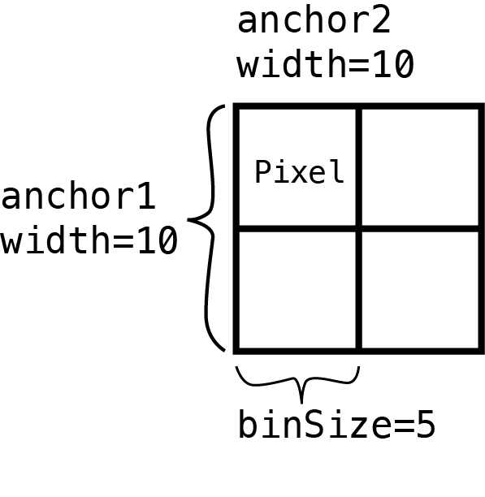
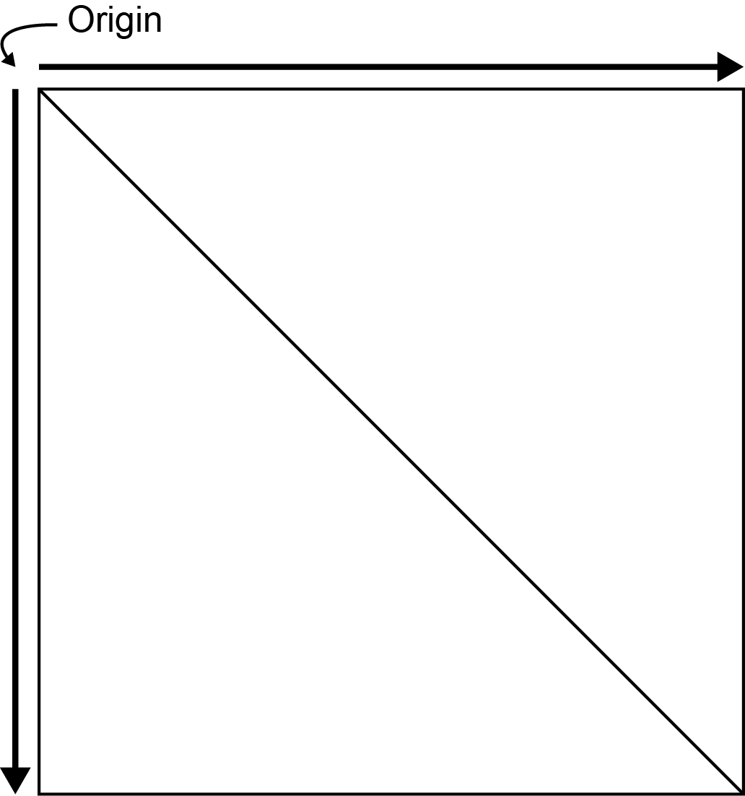

# Pulling Hi-C data with mariner

`mariner` offers 2 functions for extracting/pulling interactions from
`.hic` files -
[`pullHicPixels()`](http://ericscottdavis.com/mariner/reference/pullHicPixels.md)
and
[`pullHicMatrices()`](http://ericscottdavis.com/mariner/reference/pullHicMatrices.md).
In this article, you will learn how to extract Hi-C pixels or count
matrices and access them from the resulting objects.

[`pullHicPixels()`](http://ericscottdavis.com/mariner/reference/pullHicPixels.md)
and
[`pullHicMatrices()`](http://ericscottdavis.com/mariner/reference/pullHicMatrices.md)
accept the same set of arguments, but return different outputs. Which
function you choose depends on whether you want to extract a single
value for each interaction or a matrix of values between a range of
interactions.

## When to use `pullHicPixels()`

If you want a single value for each interaction and `.hic` file then you
should use the
[`pullHicPixels()`](http://ericscottdavis.com/mariner/reference/pullHicPixels.md)
function. We define a “pixel” as an interaction where both anchors are
the same width. The `binSize` argument is used here to check that your
desired pixel resolution matches your input interactions.


Note

You can check your `.hic` file to see which resolutions are available
for the `binSize` argument with the
[`strawr::readHicBpResolutions()`](https://rdrr.io/pkg/strawr/man/readHicBpResolutions.html).
See the
[`assignToBins()`](http://ericscottdavis.com/mariner/reference/assignToBins.md)
to set your interactions to an acceptable resolution.

The following example pulls 100-Kb pixels from two `.hic` files:

``` r
## Load mariner
library(mariner)

## Use example .hic files from ExperimentHub
hicFiles <- c(
    marinerData::LEUK_HEK_PJA27_inter_30.hic(),
    marinerData::LEUK_HEK_PJA30_inter_30.hic()
)
names(hicFiles) <- c("hic1", "hic2")

## Make some example interactions
gi <- read.table(
    text="
    1 51000000 51100000 1 51000000 51100000
    1 150000000 150100000 1 150000000 150100000
    2 51000000 51100000 2 51000000 51100000
    2 150000000 150100000 2 150000000 150100000
    "
)
gi <- as_ginteractions(gi)

## Pull Hi-C pixels
pixels <- pullHicPixels(x=gi, files=hicFiles, binSize=100e3)
pixels
```

    ## class: InteractionMatrix 
    ## dim: count matrix with 4 interactions and 2 file(s)
    ## metadata(3): binSize norm matrix
    ## assays(1): counts
    ## rownames: NULL
    ## rowData names(0):
    ## colnames(2): hic1 hic2
    ## colData names(2): files fileNames
    ## type: GInteractions
    ## regions: 4

This results in an `InteractionMatrix` object which contains the
extracted Hi-C data, interactions, and metadata for the interactions and
`.hic` files.

The extracted Hi-C data is stored as a count matrix where every row is
an interaction (i.e pixel) and each column is a `.hic` file. Use the
[`counts()`](https://rdrr.io/pkg/BiocGenerics/man/dge.html) function to
access the count matrix from an `InteractionMatrix` object.

``` r
counts(pixels)
```

    ## <4 x 2> DelayedMatrix object of type "double":
    ##      hic1 hic2
    ## [1,]   53   49
    ## [2,]   63   56
    ## [3,]   36   16
    ## [4,]   43   24

This count matrix is stored on-disk (if `onDisk=TRUE`) as an HDF5-backed
`DelayedArray` object. The data is stored in the provided file path to
the `h5File` argument. If a file path isn’t provided, a temporary file
is created in the current Rsession. To access or update the location of
the HDF5 file after using the
[`pullHicPixels()`](http://ericscottdavis.com/mariner/reference/pullHicPixels.md)
function, use the
[`path()`](https://rdrr.io/pkg/BiocGenerics/man/path.html) function.

``` r
path(pixels)
```

    ## [1] "/tmp/RtmpTYYjyF/file7f6370023d65.h5"

Note

Using a `DelayedArray` instead of a normal R matrix has a number of
benefits, especially for users working with limited computer memory. See
the
[`?DelayedArray`](https://rdrr.io/pkg/DelayedArray/man/DelayedArray-class.html)
package documentation and vignettes for more information.

The count matrix can then be used for downstream analysis such as
differential interaction analysis with `DESeq2`. To learn more about how
to access components of `InteractionMatrix` objects, see the
[`InteractionMatrix` class](#interaction_matrix_class) section below.

## When to use `pullHicMatrices()`

If you want a matrix of values for each interaction then you should use
the
[`pullHicMatrices()`](http://ericscottdavis.com/mariner/reference/pullHicMatrices.md)
function. These matrices are made up of multiple “pixels”, defined by
dividing the range of each interaction by the supplied `binSize`
parameter.



### Square matrices

For example, if you define 500x500 Kb interactions by setting the width
of both anchors to be 500 Kb

``` r
## Create 500x500 Kb regions
regions <- assignToBins(x=gi, binSize=500e3, pos1="start", pos2="start")
```

Then set the `binSize` to 100 Kb

``` r
## Pull Hi-C matrices
matrices <- pullHicMatrices(x=regions, files=hicFiles, binSize=100e3)
matrices
```

    ## class: InteractionArray 
    ## dim: 4 interaction(s), 2 file(s), 5x5 count matrix(es)
    ## metadata(3): binSize norm matrix
    ## assays(3): counts rownames colnames
    ## rownames: NULL
    ## rowData names(0):
    ## colnames(2): hic1 hic2
    ## colData names(2): files fileNames
    ## type: GInteractions
    ## regions: 4

It produces count matrices each with 5 rows and 5 columns. These count
matrices are stored in the `InteractionArray` class and are accessible
with the [`counts()`](https://rdrr.io/pkg/BiocGenerics/man/dge.html)
function.

``` r
counts(matrices)
```

    ## <5 x 5 x 4 x 2> DelayedArray object of type "double":
    ## ,,1,hic1
    ##      [,1] [,2] [,3] [,4] [,5]
    ## [1,]   53   15    5    1    4
    ## [2,]   15   68   19    8    5
    ## [3,]    5   19   69   12    2
    ## [4,]    1    8   12   48   13
    ## [5,]    4    5    2   13   48
    ## 
    ## ...
    ## 
    ## ,,4,hic2
    ##      [,1] [,2] [,3] [,4] [,5]
    ## [1,]   24   11    3    7    4
    ## [2,]   11   26    2    6    5
    ## [3,]    3    2   41   17    4
    ## [4,]    7    6   17   42   14
    ## [5,]    4    5    4   14   44

You can supply `showDimnames=TRUE` to display the start bin of each
anchor.

``` r
counts(matrices, showDimnames=TRUE)
```

    ## <5 x 5 x 4 x 2> DelayedArray object of type "double":
    ## ,,1,hic1
    ##          51000000 51100000 51200000 51300000 51400000
    ## 51000000       53       15        5        1        4
    ## 51100000       15       68       19        8        5
    ## 51200000        5       19       69       12        2
    ## 51300000        1        8       12       48       13
    ## 51400000        4        5        2       13       48
    ## 
    ## ...
    ## 
    ## ,,4,hic2
    ##           150000000 150100000 150200000 150300000 150400000
    ## 150000000        24        11         3         7         4
    ## 150100000        11        26         2         6         5
    ## 150200000         3         2        41        17         4
    ## 150300000         7         6        17        42        14
    ## 150400000         4         5         4        14        44

These 4-dimensional arrays use the first and second dimensions as the
rows and columns of the count matrices, the third dimension for each
interaction, and the fourth dimension for each `.hic` file.

If you want to convert pixels to square Hi-C regions, you can use the
[`pixelsToMatrices()`](http://ericscottdavis.com/mariner/reference/pixelsToMatrices.md)
function. The `buffer` argument describes how many pixels to expand the
ranges on either side of the center pixel. For example, to expand
100x100 Kb pixels to regions that are 500x500 Kb, specify `buffer=2` to
add two additional 100 Kb pixels on both sides of the central 100 Kb
pixels.

``` r
regions <- pixelsToMatrices(x=gi, buffer=2)
IRanges::width(regions)
```

    ## $first
    ## [1] 500001 500001 500001 500001
    ## 
    ## $second
    ## [1] 500001 500001 500001 500001

When pulled with
[`pullHicMatrices()`](http://ericscottdavis.com/mariner/reference/pullHicMatrices.md)
using `binSize=100e3` odd, 5x5 matrices result.

``` r
pullHicMatrices(x=regions, files=hicFiles, binSize=100e3)
```

    ## class: InteractionArray 
    ## dim: 4 interaction(s), 2 file(s), 5x5 count matrix(es)
    ## metadata(3): binSize norm matrix
    ## assays(3): counts rownames colnames
    ## rownames: NULL
    ## rowData names(0):
    ## colnames(2): hic1 hic2
    ## colData names(2): files fileNames
    ## type: GInteractions
    ## regions: 4

### Rectangular matrices

The previous example returns square count matrices where the width of
both anchors are the same for each interaction. `mariner` also supports
rectangular count matrices where the widths of the rows and columns are
not equal.

For example, you can define 300x600 Kb interactions by setting the width
of the first anchor to be 300 Kb and the second anchor to be 600 Kb.

``` r
## Create 300x600 Kb regions
regions <- assignToBins(
    x=gi,
    binSize=c(300e3, 600e3),
    pos1="start",
    pos2="start"
)
```

Then set the `binSize` to 100 Kb

``` r
## Pull Hi-C matrices
matrices <- pullHicMatrices(x=regions, files=hicFiles, binSize=100e3)
matrices
```

    ## class: InteractionArray 
    ## dim: 4 interaction(s), 2 file(s), 3x6 count matrix(es)
    ## metadata(3): binSize norm matrix
    ## assays(3): counts rownames colnames
    ## rownames: NULL
    ## rowData names(0):
    ## colnames(2): hic1 hic2
    ## colData names(2): files fileNames
    ## type: GInteractions
    ## regions: 8

Which produces an `InteractionArray` object with count matrices each
with 3 rows and 6 columns.

``` r
counts(matrices, showDimnames=TRUE)
```

    ## <3 x 6 x 4 x 2> DelayedArray object of type "double":
    ## ,,1,hic1
    ##          51000000 51100000 51200000 51300000 51400000 51500000
    ## 51000000       53       15        5        1        4        1
    ## 51100000       15       68       19        8        5        5
    ## 51200000        5       19       69       12        2        2
    ## 
    ## ...
    ## 
    ## ,,4,hic2
    ##           150000000 150100000 150200000 150300000 150400000 150500000
    ## 150000000        24        11         3         7         4         1
    ## 150100000        11        26         2         6         5         0
    ## 150200000         3         2        41        17         4         9

Extracting square and rectangular matrices of data results in
`InteractionArray` objects. See [`InteractionArray`
class](#interaction_array_class) to learn more about accessing data from
these objects.

### Variable matrices

`mariner` also supports extracting count matrices that are different
dimensions for each interaction.

For example, these three interactions have dimensions of 1x3, 3x3, and
3x2 after pulling matrices with a `binSize` of 100e3:

``` r
## Interactions of different dimensions
regions <- read.table(
    text="
    1 51000000 51100000 1 51000000 51300000
    1 150000000 150300000 1 150000000 150300000
    2 51000000 51300000 2 51000000 51200000
    "
)
regions <- as_ginteractions(regions)

## Pull Hi-C matrices
matrices <- pullHicMatrices(x=regions, files=hicFiles, binSize=100e3)
matrices
```

    ## class: InteractionJaggedArray
    ## dim: 3 interaction(s), 2 file(s), variable count matrix(es)
    ## metadata(3): binSize, norm, matrix
    ## colData: hic1, hic2
    ## colData names(2): files, fileNames
    ## HDF5: /tmp/RtmpTYYjyF/file7f63300f74bb.h5

The resulting object is of class `InteractionJaggedArray`. The class is
different than the previous examples because the classes that
`InteractionArray` inherits from are designed for regular, rectangular
data types. A custom class called `JaggedArray` is used to hold
irregular, or jagged, arrays of data.

The same [`counts()`](https://rdrr.io/pkg/BiocGenerics/man/dge.html)
function returns these `JaggedArray` objects containing the Hi-C count
data for each interaction and `.hic` file.

``` r
counts(matrices)
```

    ## <n x m x 3 x 2> JaggedArray:
    ## ,,1,1
    ## <1 x 3> matrix
    ##      [,1] [,2] [,3]
    ## [1,]   53   15    5
    ## 
    ## ...
    ## 
    ## ,,3,2
    ## <3 x 2> matrix
    ##      [,1] [,2]
    ## [1,]   16    6
    ## [2,]    6   17
    ## [3,]    3    7

See the [`InteractionJaggedArray`
class](#interaction_jagged_array_class) section to learn more about
accessing and transforming data from `InteractionJaggedArray` and
`JaggedArray` objects.

## `InteractionMatrix` class 

The `InteractionMatrix` class extends the `InteractionSet` and
`SummarizedExperiment` classes. Therefore, it also inherits the
accessors and methods of these objects. For example, you can access the
original interactions, metadata about the experiment, row or column
metadata, and subset or index slices of these objects. The following
sections highlight some of the most useful accessors and methods for
`InteractionMatrix` using this example object:

``` r
## Load mariner
library(mariner)

## Use example .hic files from ExperimentHub
hicFiles <- c(
    marinerData::LEUK_HEK_PJA27_inter_30.hic(),
    marinerData::LEUK_HEK_PJA30_inter_30.hic()
)
names(hicFiles) <- c("hic1", "hic2")

## Make some example interactions
gi <- read.table(
    text="
    1 51000000 51100000 1 51000000 51100000
    1 150000000 150100000 1 150000000 150100000
    2 51000000 51100000 2 51000000 51100000
    2 150000000 150100000 2 150000000 150100000
    "
)
gi <- as_ginteractions(gi)

## InteractionMatrix
imat <- pullHicPixels(x=gi, files=hicFiles, binSize=100e3)
```

### Common accessors

``` r
## Show method
imat
```

    ## class: InteractionMatrix 
    ## dim: count matrix with 4 interactions and 2 file(s)
    ## metadata(3): binSize norm matrix
    ## assays(1): counts
    ## rownames: NULL
    ## rowData names(0):
    ## colnames(2): hic1 hic2
    ## colData names(2): files fileNames
    ## type: GInteractions
    ## regions: 4

``` r
## Dimensions
dim(imat)
```

    ## [1] 4 2

``` r
## Metadata about Hi-C extraction
metadata(imat)
```

    ## $binSize
    ## [1] 1e+05
    ## 
    ## $norm
    ## [1] "NONE"
    ## 
    ## $matrix
    ## [1] "observed"

``` r
## Metadata about interactions
SummarizedExperiment::rowData(imat)
```

    ## DataFrame with 4 rows and 0 columns

``` r
## Metadata about columns
SummarizedExperiment::colData(imat)
```

    ## DataFrame with 2 rows and 2 columns
    ##                       files         fileNames
    ##                 <character>       <character>
    ## hic1 /home/runner/.cache/.. 7b5756449908_8147
    ## hic2 /home/runner/.cache/.. 7b575c1774a3_8148

``` r
## Interactions
interactions(imat)
```

    ## GInteractions object with 4 interactions and 0 metadata columns:
    ##       seqnames1             ranges1     seqnames2             ranges2
    ##           <Rle>           <IRanges>         <Rle>           <IRanges>
    ##   [1]         1   51000000-51100000 ---         1   51000000-51100000
    ##   [2]         1 150000000-150100000 ---         1 150000000-150100000
    ##   [3]         2   51000000-51100000 ---         2   51000000-51100000
    ##   [4]         2 150000000-150100000 ---         2 150000000-150100000
    ##   -------
    ##   regions: 4 ranges and 0 metadata columns
    ##   seqinfo: 2 sequences from an unspecified genome; no seqlengths

``` r
## Count matrices
counts(imat)
```

    ## <4 x 2> DelayedMatrix object of type "double":
    ##      hic1 hic2
    ## [1,]   53   49
    ## [2,]   63   56
    ## [3,]   36   16
    ## [4,]   43   24

### Indexing and subsetting

You can subset the interactions and files of the object directly where
the first position subsets interactions and the second subsets files.

``` r
imat[1:3] |> counts()
```

    ## <3 x 2> DelayedMatrix object of type "double":
    ##      hic1 hic2
    ## [1,]   53   49
    ## [2,]   63   56
    ## [3,]   36   16

``` r
imat[3:1] |> counts()
```

    ## <3 x 2> DelayedMatrix object of type "double":
    ##      hic1 hic2
    ## [1,]   36   16
    ## [2,]   63   56
    ## [3,]   53   49

``` r
imat[,2] |> counts()
```

    ## <4 x 1> DelayedMatrix object of type "double":
    ##      hic2
    ## [1,]   49
    ## [2,]   56
    ## [3,]   16
    ## [4,]   24

``` r
imat[1,1] |> counts()
```

    ## <1 x 1> DelayedMatrix object of type "double":
    ##      hic1
    ## [1,]   53

### Concatenating

Use the [`rbind()`](https://rdrr.io/pkg/BiocGenerics/man/cbind.html) or
[`cbind()`](https://rdrr.io/pkg/BiocGenerics/man/cbind.html) functions
to combine interactions row-wise or column-wise, respectively.

``` r
cbind(imat[,1], imat[,2])
```

    ## class: InteractionMatrix 
    ## dim: count matrix with 4 interactions and 2 file(s)
    ## metadata(3): binSize norm matrix
    ## assays(1): counts
    ## rownames: NULL
    ## rowData names(0):
    ## colnames(2): hic1 hic2
    ## colData names(2): files fileNames
    ## type: GInteractions
    ## regions: 4

``` r
rbind(imat[1:2,], imat[3:4,])
```

    ## class: InteractionMatrix 
    ## dim: count matrix with 4 interactions and 2 file(s)
    ## metadata(3): binSize norm matrix
    ## assays(1): counts
    ## rownames: NULL
    ## rowData names(0):
    ## colnames(2): hic1 hic2
    ## colData names(2): files fileNames
    ## type: GInteractions
    ## regions: 4

Note that the column metadata must be the same when using `rbind` and
the row interactions must be the same when using `cbind`.

``` r
rbind(imat[1:2,1], imat[3:4,2])
```

    ## Error in `rbind()`:
    ## ! Can't rbind InteractionMatrix objects with different colData.

``` r
cbind(imat[1:2,1], imat[3:4,2])
```

    ## Error in `cbind()`:
    ## ! interactions must be identical in 'cbind'

### Overlapping

Methods for
[`subsetByOverlaps()`](http://ericscottdavis.com/mariner/reference/InteractionJaggedArray-overlaps.md),
[`findOverlaps()`](http://ericscottdavis.com/mariner/reference/InteractionJaggedArray-overlaps.md),
[`countOverlaps()`](http://ericscottdavis.com/mariner/reference/InteractionJaggedArray-overlaps.md),
and
[`overlapsAny()`](http://ericscottdavis.com/mariner/reference/InteractionJaggedArray-overlaps.md)
are inherited from the `InteractionSet` and `IRanges` packages. See the
documentation and vignettes of these packages for usage and behavior of
these functions.

## `InteractionArray` class 

The `InteractionArray` class extends the `InteractionSet` and
`SummarizedExperiment` classes. Therefore, it also inherits the
accessors and methods of these objects. For example, you can access the
original interactions, metadata about the experiment, row or column
metadata, and subset or index slices of these objects. Unlike the the
`InteractionMatrix` class which returns an “interaction-by-Hi-C” matrix,
the `InteractionArray` class returns count matrices for each interaction
and `.hic` file. This results in a 4-dimensional array, where the first
two dimensions are the rows and columns of the count matrices, the third
dimension is the supplied interactions, and the fourth dimension is the
supplied `.hic` files. This is stored as a `DelayedArray` which is
accessible via the
[`counts()`](https://rdrr.io/pkg/BiocGenerics/man/dge.html) accessor.
The following sections highlight some of the most useful accessors and
methods for `InteractionMatrix` using this example object:

``` r
## Load mariner
library(mariner)

## Use example .hic files from ExperimentHub
hicFiles <- c(
    marinerData::LEUK_HEK_PJA27_inter_30.hic(),
    marinerData::LEUK_HEK_PJA30_inter_30.hic()
)
names(hicFiles) <- c("hic1", "hic2")

## Create 500x500 Kb regions
regions <- read.table(
    text="
    1 51000000 51500000 1 51000000 51500000
    1 150000000 150500000 1 150000000 150500000
    2 51000000 51500000 2 51000000 51500000
    2 150000000 150500000 2 150000000 150500000
    "
)
regions <- as_ginteractions(regions)

## InteractionArray
ia <- pullHicMatrices(x=regions, files=hicFiles, binSize=100e3)
```

### Common accessors

``` r
## Show method
ia
```

    ## class: InteractionArray 
    ## dim: 4 interaction(s), 2 file(s), 5x5 count matrix(es)
    ## metadata(3): binSize norm matrix
    ## assays(3): counts rownames colnames
    ## rownames: NULL
    ## rowData names(0):
    ## colnames(2): hic1 hic2
    ## colData names(2): files fileNames
    ## type: GInteractions
    ## regions: 4

``` r
## Dimensions
dim(ia)
```

    ## [1] 4 2

``` r
## Metadata about Hi-C extraction
metadata(ia)
```

    ## $binSize
    ## [1] 1e+05
    ## 
    ## $norm
    ## [1] "NONE"
    ## 
    ## $matrix
    ## [1] "observed"

``` r
## Metadata about interactions
SummarizedExperiment::rowData(ia)
```

    ## DataFrame with 4 rows and 0 columns

``` r
## Metadata about columns
SummarizedExperiment::colData(ia)
```

    ## DataFrame with 2 rows and 2 columns
    ##                       files         fileNames
    ##                 <character>       <character>
    ## hic1 /home/runner/.cache/.. 7b5756449908_8147
    ## hic2 /home/runner/.cache/.. 7b575c1774a3_8148

``` r
## Interactions
interactions(ia)
```

    ## GInteractions object with 4 interactions and 0 metadata columns:
    ##       seqnames1             ranges1     seqnames2             ranges2
    ##           <Rle>           <IRanges>         <Rle>           <IRanges>
    ##   [1]         1   51000000-51500000 ---         1   51000000-51500000
    ##   [2]         1 150000000-150500000 ---         1 150000000-150500000
    ##   [3]         2   51000000-51500000 ---         2   51000000-51500000
    ##   [4]         2 150000000-150500000 ---         2 150000000-150500000
    ##   -------
    ##   regions: 4 ranges and 0 metadata columns
    ##   seqinfo: 2 sequences from an unspecified genome; no seqlengths

``` r
## Count matrices
counts(ia)
```

    ## <5 x 5 x 4 x 2> DelayedArray object of type "double":
    ## ,,1,hic1
    ##      [,1] [,2] [,3] [,4] [,5]
    ## [1,]   53   15    5    1    4
    ## [2,]   15   68   19    8    5
    ## [3,]    5   19   69   12    2
    ## [4,]    1    8   12   48   13
    ## [5,]    4    5    2   13   48
    ## 
    ## ...
    ## 
    ## ,,4,hic2
    ##      [,1] [,2] [,3] [,4] [,5]
    ## [1,]   24   11    3    7    4
    ## [2,]   11   26    2    6    5
    ## [3,]    3    2   41   17    4
    ## [4,]    7    6   17   42   14
    ## [5,]    4    5    4   14   44

``` r
## Counts with start bins for anchor1 and 2
counts(ia, showDimnames=TRUE)
```

    ## <5 x 5 x 4 x 2> DelayedArray object of type "double":
    ## ,,1,hic1
    ##          51000000 51100000 51200000 51300000 51400000
    ## 51000000       53       15        5        1        4
    ## 51100000       15       68       19        8        5
    ## 51200000        5       19       69       12        2
    ## 51300000        1        8       12       48       13
    ## 51400000        4        5        2       13       48
    ## 
    ## ...
    ## 
    ## ,,4,hic2
    ##           150000000 150100000 150200000 150300000 150400000
    ## 150000000        24        11         3         7         4
    ## 150100000        11        26         2         6         5
    ## 150200000         3         2        41        17         4
    ## 150300000         7         6        17        42        14
    ## 150400000         4         5         4        14        44

### Indexing and subsetting

You can subset the interactions and files of the object directly where
the first position subsets interactions and the second subsets files.

``` r
ia[1:3] |> counts()
```

    ## <5 x 5 x 3 x 2> DelayedArray object of type "double":
    ## ,,1,hic1
    ##      [,1] [,2] [,3] [,4] [,5]
    ## [1,]   53   15    5    1    4
    ## [2,]   15   68   19    8    5
    ## [3,]    5   19   69   12    2
    ## [4,]    1    8   12   48   13
    ## [5,]    4    5    2   13   48
    ## 
    ## ...
    ## 
    ## ,,3,hic2
    ##      [,1] [,2] [,3] [,4] [,5]
    ## [1,]   16    6    3    2    4
    ## [2,]    6   17    7    2    0
    ## [3,]    3    7   23    6    0
    ## [4,]    2    2    6   23    2
    ## [5,]    4    0    0    2   24

``` r
ia[3:1] |> counts()
```

    ## <5 x 5 x 3 x 2> DelayedArray object of type "double":
    ## ,,1,hic1
    ##      [,1] [,2] [,3] [,4] [,5]
    ## [1,]   36    5    5    2    4
    ## [2,]    5   30   13    4    1
    ## [3,]    5   13   22    6    6
    ## [4,]    2    4    6   30    4
    ## [5,]    4    1    6    4   21
    ## 
    ## ...
    ## 
    ## ,,3,hic2
    ##      [,1] [,2] [,3] [,4] [,5]
    ## [1,]   49   27    4    5    3
    ## [2,]   27   49   13    2    6
    ## [3,]    4   13   56    7    8
    ## [4,]    5    2    7   48   10
    ## [5,]    3    6    8   10   47

``` r
ia[,2] |> counts()
```

    ## <5 x 5 x 4 x 1> DelayedArray object of type "double":
    ## ,,1,hic2
    ##      [,1] [,2] [,3] [,4] [,5]
    ## [1,]   49   27    4    5    3
    ## [2,]   27   49   13    2    6
    ## [3,]    4   13   56    7    8
    ## [4,]    5    2    7   48   10
    ## [5,]    3    6    8   10   47
    ## 
    ## ...
    ## 
    ## ,,4,hic2
    ##      [,1] [,2] [,3] [,4] [,5]
    ## [1,]   24   11    3    7    4
    ## [2,]   11   26    2    6    5
    ## [3,]    3    2   41   17    4
    ## [4,]    7    6   17   42   14
    ## [5,]    4    5    4   14   44

``` r
ia[1,1] |> counts()
```

    ## <5 x 5 x 1 x 1> DelayedArray object of type "double":
    ## ,,1,hic1
    ##      [,1] [,2] [,3] [,4] [,5]
    ## [1,]   53   15    5    1    4
    ## [2,]   15   68   19    8    5
    ## [3,]    5   19   69   12    2
    ## [4,]    1    8   12   48   13
    ## [5,]    4    5    2   13   48

Subsetting and indexing can also be done on the `DelayedArray` object
accessed with
[`counts()`](https://rdrr.io/pkg/BiocGenerics/man/dge.html). For
example, the following code shows how you could access the top left
corner of the count matrix of the first interaction and `.hic` file.

``` r
counts(ia)[1:3, 1:3, 1, 1]
```

    ## <3 x 3> DelayedMatrix object of type "double":
    ##      [,1] [,2] [,3]
    ## [1,]   53   15    5
    ## [2,]   15   68   19
    ## [3,]    5   19   69

### Concatenating

Use the [`rbind()`](https://rdrr.io/pkg/BiocGenerics/man/cbind.html) or
[`cbind()`](https://rdrr.io/pkg/BiocGenerics/man/cbind.html) functions
to combine interactions row-wise or column-wise, respectively.

``` r
cbind(ia[,1], ia[,2])
```

    ## class: InteractionArray 
    ## dim: 4 interaction(s), 2 file(s), 5x5 count matrix(es)
    ## metadata(3): binSize norm matrix
    ## assays(3): counts rownames colnames
    ## rownames: NULL
    ## rowData names(0):
    ## colnames(2): hic1 hic2
    ## colData names(2): files fileNames
    ## type: GInteractions
    ## regions: 4

``` r
rbind(ia[1:2,], ia[3:4,])
```

    ## class: InteractionArray 
    ## dim: 4 interaction(s), 2 file(s), 5x5 count matrix(es)
    ## metadata(3): binSize norm matrix
    ## assays(3): counts rownames colnames
    ## rownames: NULL
    ## rowData names(0):
    ## colnames(2): hic1 hic2
    ## colData names(2): files fileNames
    ## type: GInteractions
    ## regions: 4

Note that the column metadata must be the same when using `rbind` and
the row interactions must be the same when using `cbind`.

``` r
rbind(ia[1:2,1], ia[3:4,2])
```

    ## Error in `rbind()`:
    ## ! Can't rbind InteractionArray objects with different colData.

``` r
cbind(ia[1:2,1], ia[3:4,2])
```

    ## Error in `cbind()`:
    ## ! interactions must be identical in 'cbind'

### Overlapping

Methods for
[`subsetByOverlaps()`](http://ericscottdavis.com/mariner/reference/InteractionJaggedArray-overlaps.md),
[`findOverlaps()`](http://ericscottdavis.com/mariner/reference/InteractionJaggedArray-overlaps.md),
[`countOverlaps()`](http://ericscottdavis.com/mariner/reference/InteractionJaggedArray-overlaps.md),
and
[`overlapsAny()`](http://ericscottdavis.com/mariner/reference/InteractionJaggedArray-overlaps.md)
are inherited from the `InteractionSet` and `IRanges` packages. See the
documentation and vignettes of these packages for usage and behavior of
these functions.

## `InteractionJaggedArray` class 

The `InteractionJaggedArray` class is a new class designed for holding
irregularly sized count matrices, also known as “ragged” or “jagged”
arrays along with other important information about the extracted Hi-C
data. The count matrices are managed by the `JaggedArray` class which is
analogous to the `DelayedArray` class. `JaggedArray` data is stored
on-disk in an HDF5 file, and subsetting/indexing operations are delayed
similarly to `DelayedArray`. Continue reading to learn about how to use
`InteractionJaggedArray` and `JaggedArray` objects, and how to convert
them to `InteractionArray` or `DelayedArray` objects with the
[`regularize()`](http://ericscottdavis.com/mariner/reference/regularize.md)
function for downstream analysis.

``` r
## Load mariner
library(mariner)

## Use example .hic files from ExperimentHub
hicFiles <- c(
    marinerData::LEUK_HEK_PJA27_inter_30.hic(),
    marinerData::LEUK_HEK_PJA30_inter_30.hic()
)
names(hicFiles) <- c("hic1", "hic2")

## Create regions of different dimensions
regions <- read.table(
    text="
    1 51000000 51100000 1 51000000 51300000
    1 150000000 150300000 1 150000000 150300000
    2 51000000 51300000 2 51000000 51200000
    "
)
regions <- as_ginteractions(regions)

## InteractionJaggedArray
ija <- pullHicMatrices(x=regions, files=hicFiles, binSize=100e3)
```

### Common accessors

``` r
## Show method
ija
```

    ## class: InteractionJaggedArray
    ## dim: 3 interaction(s), 2 file(s), variable count matrix(es)
    ## metadata(3): binSize, norm, matrix
    ## colData: hic1, hic2
    ## colData names(2): files, fileNames
    ## HDF5: /tmp/RtmpTYYjyF/file7f632172c714.h5

The variable dimensions of the jagged arrays can be accessed with the
[`dim()`](https://rdrr.io/r/base/dim.html) function:

``` r
## Dimensions
dim(ija)
```

    ## $interactions
    ## [1] 3
    ## 
    ## $files
    ## [1] 2
    ## 
    ## $rows
    ## [1] 1 3 3
    ## 
    ## $cols
    ## [1] 3 3 2

``` r
## Metadata about Hi-C extraction
metadata(ija)
```

    ## $binSize
    ## [1] 1e+05
    ## 
    ## $norm
    ## [1] "NONE"
    ## 
    ## $matrix
    ## [1] "observed"

``` r
## Metadata about columns
SummarizedExperiment::colData(ija)
```

    ## DataFrame with 2 rows and 2 columns
    ##                       files         fileNames
    ##                 <character>       <character>
    ## hic1 /home/runner/.cache/.. 7b5756449908_8147
    ## hic2 /home/runner/.cache/.. 7b575c1774a3_8148

``` r
## Access HDF5 filepath
path(ija)
```

    ## [1] "/tmp/RtmpTYYjyF/file7f632172c714.h5"

``` r
## Interactions
interactions(ija)
```

    ## GInteractions object with 3 interactions and 0 metadata columns:
    ##       seqnames1             ranges1     seqnames2             ranges2
    ##           <Rle>           <IRanges>         <Rle>           <IRanges>
    ##   [1]         1   51000000-51100000 ---         1   51000000-51300000
    ##   [2]         1 150000000-150300000 ---         1 150000000-150300000
    ##   [3]         2   51000000-51300000 ---         2   51000000-51200000
    ##   -------
    ##   regions: 5 ranges and 0 metadata columns
    ##   seqinfo: 2 sequences from an unspecified genome; no seqlengths

The [`counts()`](https://rdrr.io/pkg/BiocGenerics/man/dge.html) function
returns a `JaggedArray`

``` r
## Count matrices as JaggedArray
ja <- counts(ija)
ja
```

    ## <n x m x 3 x 2> JaggedArray:
    ## ,,1,1
    ## <1 x 3> matrix
    ##      [,1] [,2] [,3]
    ## [1,]   53   15    5
    ## 
    ## ...
    ## 
    ## ,,3,2
    ## <3 x 2> matrix
    ##      [,1] [,2]
    ## [1,]   16    6
    ## [2,]    6   17
    ## [3,]    3    7

This can be converted to a nested R list with the
[`as.list()`](https://rdrr.io/pkg/BiocGenerics/man/as.list.html)
function, where the outer level refers to the `.hic` file and the inner
level contains a matrix for each interaction.

``` r
as.list(ja)
```

    ## [[1]]
    ## [[1]][[1]]
    ##      [,1] [,2] [,3]
    ## [1,]   53   15    5
    ## 
    ## [[1]][[2]]
    ##      [,1] [,2] [,3]
    ## [1,]   63   25   15
    ## [2,]   25   68   28
    ## [3,]   15   28   87
    ## 
    ## [[1]][[3]]
    ##      [,1] [,2]
    ## [1,]   36    5
    ## [2,]    5   30
    ## [3,]    5   13
    ## 
    ## 
    ## [[2]]
    ## [[2]][[1]]
    ##      [,1] [,2] [,3]
    ## [1,]   49   27    4
    ## 
    ## [[2]][[2]]
    ##      [,1] [,2] [,3]
    ## [1,]   56   26    8
    ## [2,]   26   60   14
    ## [3,]    8   14   89
    ## 
    ## [[2]][[3]]
    ##      [,1] [,2]
    ## [1,]   16    6
    ## [2,]    6   17
    ## [3,]    3    7

### Indexing and subsetting

You can subset the interactions and files of the object directly where
the first position subsets interactions and the second subsets files.

``` r
ija[1:2] |> counts()
```

    ## <n x m x 2 x 2> JaggedArray:
    ## ,,1,1
    ## <1 x 3> matrix
    ##      [,1] [,2] [,3]
    ## [1,]   53   15    5
    ## 
    ## ...
    ## 
    ## ,,2,2
    ## <3 x 3> matrix
    ##      [,1] [,2] [,3]
    ## [1,]   56   26    8
    ## [2,]   26   60   14
    ## [3,]    8   14   89

``` r
ija[2:1] |> counts()
```

    ## <n x m x 2 x 2> JaggedArray:
    ## ,,1,1
    ## <3 x 3> matrix
    ##      [,1] [,2] [,3]
    ## [1,]   63   25   15
    ## [2,]   25   68   28
    ## [3,]   15   28   87
    ## 
    ## ...
    ## 
    ## ,,2,2
    ## <1 x 3> matrix
    ##      [,1] [,2] [,3]
    ## [1,]   49   27    4

``` r
ija[,2] |> counts()
```

    ## <n x m x 3 x 1> JaggedArray:
    ## ,,1,1
    ## <1 x 3> matrix
    ##      [,1] [,2] [,3]
    ## [1,]   49   27    4
    ## 
    ## ...
    ## 
    ## ,,3,1
    ## <3 x 2> matrix
    ##      [,1] [,2]
    ## [1,]   16    6
    ## [2,]    6   17
    ## [3,]    3    7

``` r
ija[1,1] |> counts()
```

    ## <1 x 3 x 1 x 1> DelayedArray object of type "double":
    ## ,,1,hic1
    ##      [,1] [,2] [,3]
    ## [1,]   53   15    5

Notice that when indexing results in subset of data with the same
dimensions it is automatically coerced to an `InteractionArray` or
`DelayedArray`.

``` r
ija[3,1] |> class()
```

    ## [1] "InteractionArray"
    ## attr(,"package")
    ## [1] "mariner"

``` r
ija[3,1] |> counts() |> class()
```

    ## [1] "DelayedArray"
    ## attr(,"package")
    ## [1] "DelayedArray"

You can also subset and index on the `JaggedArray` object by selecting
the desired interactions(s) in the third dimension and `.hic` file(s) in
the fourth dimension. Since the first two dimensions are variable,
subsetting/indexing these is not supported.

``` r
ja[,,3,2]
```

    ## <3 x 2 x 1 x 1> DelayedArray object of type "double":
    ## ,,1,1
    ##      [,1] [,2]
    ## [1,]   16    6
    ## [2,]    6   17
    ## [3,]    3    7

If the selection results in a `DelayedArray` then normal indexing rules
apply:

``` r
ja[,,3,2][1:2,1,1,1]
```

    ## [1] 16  6

### Concatenating

Concatenating `InteractionJaggedArray` and `JaggedArray` objects is not
currently supported. If you need this functionality please post an
[issue](https://github.com/EricSDavis/mariner/issues) to the mariner
repository or (even better) submit a pull request with an
implementation.

### Overlapping

Methods for
[`subsetByOverlaps()`](http://ericscottdavis.com/mariner/reference/InteractionJaggedArray-overlaps.md),
[`findOverlaps()`](http://ericscottdavis.com/mariner/reference/InteractionJaggedArray-overlaps.md),
[`countOverlaps()`](http://ericscottdavis.com/mariner/reference/InteractionJaggedArray-overlaps.md),
and
[`overlapsAny()`](http://ericscottdavis.com/mariner/reference/InteractionJaggedArray-overlaps.md)
are inherited from the `InteractionSet` and `IRanges` packages. See the
documentation and vignettes of these packages for usage and behavior of
these functions.

### Converting to regular arrays

For downstream aggregation and visualization, it is helpful to convert
irregular/jagged arrays to regular arrays. The
[`regularize()`](http://ericscottdavis.com/mariner/reference/regularize.md)
function stretches and (optionally) scales the count matrices into the
desired rectangular (or square) matrices with dimensions supplied to
`ndim`. The function works on both `InteractionJaggedArray` and
`JaggedArray` objects.

``` r
regularize(x=ija, ndim=c(3,3)) |> counts()
```

    ## / Reading and realizing block 1/3 of file 1/2 ... OK
    ## \ Processing it ... Loading required namespace: fields
    ## OK
    ## / Reading and realizing block 2/3 of file 1/2 ... OK
    ## \ Processing it ... OK
    ## / Reading and realizing block 3/3 of file 1/2 ... OK
    ## \ Processing it ... OK
    ## / Reading and realizing block 1/3 of file 2/2 ... OK
    ## \ Processing it ... OK
    ## / Reading and realizing block 2/3 of file 2/2 ... OK
    ## \ Processing it ... OK
    ## / Reading and realizing block 3/3 of file 2/2 ... OK
    ## \ Processing it ... OK

    ## <3 x 3 x 3 x 2> DelayedArray object of type "double":
    ## ,,1,hic1
    ##            [,1]       [,2]       [,3]
    ## [1,] 0.24200913 0.06849315 0.02283105
    ## [2,] 0.24200913 0.06849315 0.02283105
    ## [3,] 0.24200913 0.06849315 0.02283105
    ## 
    ## ,,2,hic1
    ##            [,1]       [,2]       [,3]
    ## [1,] 0.17796610 0.07062147 0.04237288
    ## [2,] 0.07062147 0.19209040 0.07909605
    ## [3,] 0.04237288 0.07909605 0.24576271
    ## 
    ## ,,3,hic1
    ##            [,1]       [,2]       [,3]
    ## [1,] 0.25531915 0.14539007 0.03546099
    ## [2,] 0.03546099 0.12411348 0.21276596
    ## [3,] 0.03546099 0.06382979 0.09219858
    ## 
    ## ,,1,hic2
    ##            [,1]       [,2]       [,3]
    ## [1,] 0.20416667 0.11250000 0.01666667
    ## [2,] 0.20416667 0.11250000 0.01666667
    ## [3,] 0.20416667 0.11250000 0.01666667
    ## 
    ## ,,2,hic2
    ##            [,1]       [,2]       [,3]
    ## [1,] 0.18604651 0.08637874 0.02657807
    ## [2,] 0.08637874 0.19933555 0.04651163
    ## [3,] 0.02657807 0.04651163 0.29568106
    ## 
    ## ,,3,hic2
    ##            [,1]       [,2]       [,3]
    ## [1,] 0.19393939 0.13333333 0.07272727
    ## [2,] 0.07272727 0.13939394 0.20606061
    ## [3,] 0.03636364 0.06060606 0.08484848

``` r
regularize(x=ja, ndim=c(3,3))
```

    ## / Reading and realizing block 1/3 of file 1/2 ... OK
    ## \ Processing it ... OK
    ## / Reading and realizing block 2/3 of file 1/2 ... OK
    ## \ Processing it ... OK
    ## / Reading and realizing block 3/3 of file 1/2 ... OK
    ## \ Processing it ... OK
    ## / Reading and realizing block 1/3 of file 2/2 ... OK
    ## \ Processing it ... OK
    ## / Reading and realizing block 2/3 of file 2/2 ... OK
    ## \ Processing it ... OK
    ## / Reading and realizing block 3/3 of file 2/2 ... OK
    ## \ Processing it ... OK

    ## <3 x 3 x 3 x 2> HDF5Array object of type "double":
    ## ,,1,1
    ##            [,1]       [,2]       [,3]
    ## [1,] 0.24200913 0.06849315 0.02283105
    ## [2,] 0.24200913 0.06849315 0.02283105
    ## [3,] 0.24200913 0.06849315 0.02283105
    ## 
    ## ,,2,1
    ##            [,1]       [,2]       [,3]
    ## [1,] 0.17796610 0.07062147 0.04237288
    ## [2,] 0.07062147 0.19209040 0.07909605
    ## [3,] 0.04237288 0.07909605 0.24576271
    ## 
    ## ,,3,1
    ##            [,1]       [,2]       [,3]
    ## [1,] 0.25531915 0.14539007 0.03546099
    ## [2,] 0.03546099 0.12411348 0.21276596
    ## [3,] 0.03546099 0.06382979 0.09219858
    ## 
    ## ,,1,2
    ##            [,1]       [,2]       [,3]
    ## [1,] 0.20416667 0.11250000 0.01666667
    ## [2,] 0.20416667 0.11250000 0.01666667
    ## [3,] 0.20416667 0.11250000 0.01666667
    ## 
    ## ,,2,2
    ##            [,1]       [,2]       [,3]
    ## [1,] 0.18604651 0.08637874 0.02657807
    ## [2,] 0.08637874 0.19933555 0.04651163
    ## [3,] 0.02657807 0.04651163 0.29568106
    ## 
    ## ,,3,2
    ##            [,1]       [,2]       [,3]
    ## [1,] 0.19393939 0.13333333 0.07272727
    ## [2,] 0.07272727 0.13939394 0.20606061
    ## [3,] 0.03636364 0.06060606 0.08484848

By using
[`regularize()`](http://ericscottdavis.com/mariner/reference/regularize.md)
before extracting counts, you can take advantage of the block and
parallel processing functionality from aggregating with
[`aggHicMatrices()`](http://ericscottdavis.com/mariner/reference/aggHicMatrices.md):

``` r
regularize(x=ija, ndim=c(3,3), nBlocks=1) |>
    aggHicMatrices(nBlocks=1)
```

    ## / Reading and realizing block 1/1 of file 1/2 ... OK
    ## \ Processing it ... OK
    ## / Reading and realizing block 1/1 of file 2/2 ... OK
    ## \ Processing it ... OK
    ## / reading and realizing block 1/1 ... ok
    ## \ processing it ... ok

    ## <3 x 3> DelayedMatrix object of type "double":
    ##           [,1]      [,2]      [,3]
    ## [1,] 1.2594470 0.6167168 0.2166369
    ## [2,] 0.7113643 0.8359265 0.5839320
    ## [3,] 0.5869514 0.4310367 0.7579886

## Other pullHic\* arguments

The previous sections provided examples of using
[`pullHicPixels()`](http://ericscottdavis.com/mariner/reference/pullHicPixels.md)
and
[`pullHicMatrices()`](http://ericscottdavis.com/mariner/reference/pullHicMatrices.md),
for extracting Hi-C pixels and count matrices, respectively. These
functions require three mandatory arguments: `x` for interactions,
`files` for `.hic` file paths, and `binSize` for the Hi-C resolution.

Additionally, the remaining arguments allow for greater control over the
Hi-C data extraction process. These arguments control the type of Hi-C
data to be extracted, the efficiency of extraction, and specify the
storage location for the extracted data.

In this section we delve deeper into the utilization of these arguments
to effectively extract Hi-C data.

### Normalization and matrix type

The `norm` and `matrix` arguments are passed to `strawr` during the
extraction step.

`norm` refers to the Hi-C normalization and is limited to pre-computed
normalizations in the `.hic` file. Use the
[`readHicNormTypes()`](https://rdrr.io/pkg/strawr/man/readHicNormTypes.html)
function from the `strawr` package to see available normalizations.

``` r
pullHicPixels(x=gi, files=hicFiles, binSize=100e3, norm="none")
```

    ## Error in `.checkStrawArgs()`:
    ## ! `norm` must be one of "VC_SQRT", "NONE", "VC", or "KR", not "none".
    ## ℹ Did you mean "NONE"?

The `matrix` argument specifies the type of values to extract. The
default is the “observed” contact frequency values. Other options
include “expected” contact frequency and the “oe” or observed/expected
values. For an in-depth description of these matrix types see [Durand et
al. 2016](https://doi.org/10.1016/j.cels.2016.07.002)

``` r
pullHicPixels(x=gi, files=hicFiles, binSize=100e3, matrix="oe") |>
    counts()
```

    ## <4 x 2> DelayedMatrix object of type "double":
    ##           hic1      hic2
    ## [1,] 1.0564467 1.1543123
    ## [2,] 1.2557763 1.3192140
    ## [3,] 0.9188343 0.5032488
    ## [4,] 1.0974965 0.7548732

### The `half` parameter

The Hi-C matrix is a square, symmetric matrix that captures the
frequency of all pair-wise interactions between genomic loci. In other
words, each point in a Hi-C matrix represents the interaction frequency
between a two pairs, or anchors, of genomic regions.

In `mariner`, the Hi-C matrix is oriented with the origin (lowest
genomic coordinates) in the upper left corner with linear genomic
position increasing down and to the right.



The first anchor, or genomic locus, corresponds on the vertical axis
(rows of matrix) while the second anchor corresponds to the horizontal
axis (columns of the matrix). Together, these anchors specify a
two-dimensional region on the Hi-C matrix.


The relative positions of these anchors determines from which “half” of
the matrix data is extracted. When the genomic position of the first
anchor is less than the second anchor the region resides in the upper
trianglar.


When the genomic position of the first anchor is greater than the second
anchor the region resides in the lower triangular.


If the first and second anchors are equal then the region is on the
diagonal and the values will be mirrored across the diagonal.


To summarize:

- first \< second - upper triangular
- first \> second - lower triangular
- first == second - mirrored diagonal

The `half` parameter controls which portion of the Hi-C matrix is
returned, regardless of anchor position. When `half="upper"` only
upper-triangular data is returned. When `half="lower"` only
lower-triangular data is returned. `half="both"` returns upper and lower
triangular data. `NA` values are returned for portions of the matrix
that do not match the region of the matrix specified with `half`. The
figure and code below show how data are returned for a region that
resides on the diagonal, crossing into both the upper and lower
triangular of the Hi-C matrix.


``` r
## Hic file
hic <- marinerData::LEUK_HEK_PJA27_inter_30.hic()

## On-diagonal interaction
diagonal <- as_ginteractions(read.table(text="
    1 51000000 51300000 1 51000000 51300000
"))

## half="upper"
pullHicMatrices(x=diagonal, files=hic, binSize=100e3, half="upper") |>
    counts()
```

    ## <3 x 3 x 1 x 1> DelayedArray object of type "double":
    ## ,,1,EH8088
    ##      [,1] [,2] [,3]
    ## [1,]   53   15    5
    ## [2,]   NA   68   19
    ## [3,]   NA   NA   69

``` r
## half="lower"
pullHicMatrices(x=diagonal, files=hic, binSize=100e3, half="lower") |>
    counts()
```

    ## <3 x 3 x 1 x 1> DelayedArray object of type "double":
    ## ,,1,EH8088
    ##      [,1] [,2] [,3]
    ## [1,]   53   NA   NA
    ## [2,]   15   68   NA
    ## [3,]    5   19   69

``` r
## half="both"
pullHicMatrices(x=diagonal, files=hic, binSize=100e3, half="both") |>
    counts()
```

    ## <3 x 3 x 1 x 1> DelayedArray object of type "double":
    ## ,,1,EH8088
    ##      [,1] [,2] [,3]
    ## [1,]   53   15    5
    ## [2,]   15   68   19
    ## [3,]    5   19   69

Since chromosomes have no inherent order in linear genomic space, the
`half` parameter is ignored for interchromosomal interactions.
[`pullHicPixels()`](http://ericscottdavis.com/mariner/reference/pullHicPixels.md)
behaves the same way with the `half` parameter.

### Changing `blockSize` for large data

[`pullHicPixels()`](http://ericscottdavis.com/mariner/reference/pullHicPixels.md)
and
[`pullHicMatrices()`](http://ericscottdavis.com/mariner/reference/pullHicMatrices.md)
allow you to tune the efficiency and memory-usage of Hi-C data
extraction by grouping nearby interactions into blocks. The block data
is then loaded into memory, assigned to interactions, and then written
to back to disk as an HDF5 file. You can modify the `blockSize` (in
base-pairs) to control the size and number of blocks that are extracted.
Pulling larger blocks decreases run-time, but requires more RAM to store
these data while smaller blocks increase run-time, but allows you to
extract counts from large Hi-C files that may not otherwise fit into
memory.

Adjustments to `blockSize` can optimize the efficiency of extraction.
There is a trade-off between the size of the block and the number of
iterations required to extract all interactions. The size and placement
of interactions on the genome also affects the `blockSize`. For example,
a worst-case performance scenario would be extracting each interaction
individually (setting `blockSize` to the width of the interaction).
Generally, it is most efficient to extract the largest blocks possible.
When your data is small enough, pulling whole chromosomes is usually
most efficient. However, the optimal `blockSize` is highly dependent on
both the interactions and `.hic` files, so you may want to experiment
with this parameter to find the best trade-off for your data.

The `compressionLevel` and `chunkSize` parameters control the way
extracted data is written back to the HDF5-file. See
[`?pullHicMatrices`](http://ericscottdavis.com/mariner/reference/pullHicMatrices.md)
or
[`?pullHicPixels`](http://ericscottdavis.com/mariner/reference/pullHicPixels.md)
for a more in-depth description of these parameters.
