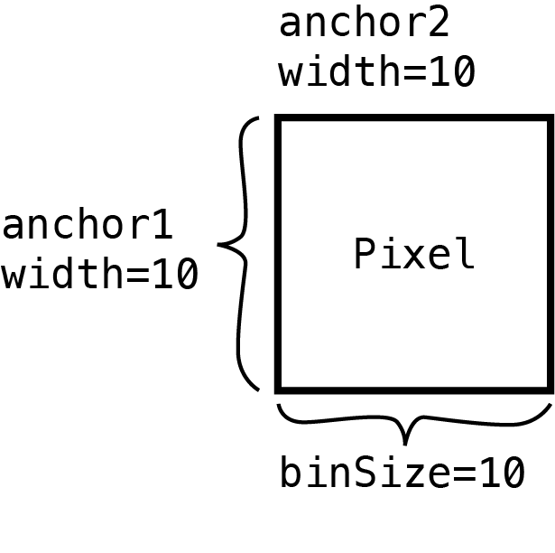
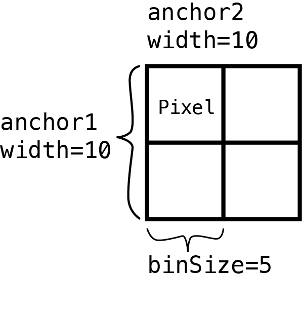

```{r setup, include=FALSE}
knitr::opts_chunk$set(echo = TRUE)
```

`mariner` offers 2 functions for extracting/pulling
interactions from `.hic` files - `pullHicPixels()` and
`pullHicMatrices()`. In this article, you will learn how
to extract Hi-C pixels or count matrices and access them
from the resulting objects.

`pullHicPixels()` and `pullHicMatrices()` accept the same
set of arguments, but return different outputs. Which
function you choose depends on whether you want to extract
a single value for each interaction or a matrix of values
between a range of interactions.

# When to use `pullHicPixels()`

If you want a single value for each interaction and `.hic`
file then you should use the `pullHicPixels()` function.
We define a "pixel" as an interaction where both anchors
are the same width. The `binSize` argument is used here
to check that your desired pixel resolution matches your
input interactions.

```{r pixelFigure, fig.align='center', out.width='75%', echo=FALSE}
# 
```

<div style="
padding: .5em 1em;
margin-bottom: 10px;
border-radius:5px;
border-left: 5px solid #2780e3;
border-right: 1px solid #dee2e6;
border-top: 1px solid #dee2e6;
border-bottom: 1px solid #dee2e6;
">
<div style="font-weight: 600; opacity: 75%;">
<p style="margin:0px">Note</p>
</div>
You can check your `.hic` file to see which resolutions
are available for the `binSize` argument with the 
`strawr::readHicBpResolutions()`. See the `binPairs()`
to set your interactions to an acceptable resolution.
</div>

The following example pulls 100-Kb pixels from two
`.hic` files:

```{r pullPixels, message=FALSE}
## Load mariner
library(mariner)

## Use example .hic files from ExperimentHub
hicFiles <- c(
    marinerData::LEUK_HEK_PJA27_inter_30.hic(),
    marinerData::LEUK_HEK_PJA30_inter_30.hic()
)
names(hicFiles) <- c("hic1", "hic2")

## Make some example interactions
gi <- read.table(
    text="
    1 51000000 51100000 1 51000000 51100000
    1 150000000	150100000 1	150000000 150100000
    2 51000000 51100000 2 51000000 51100000
    2 150000000	150100000 2	150000000 150100000
    "
)
gi <- as_ginteractions(gi)

## Pull Hi-C pixels
pixels <- pullHicPixels(x=gi, files=hicFiles, binSize=100e3)
pixels
```

This results in an `InteractionMatrix` object which
contains the extracted Hi-C data, interactions, and
metadata for the interactions and `.hic` files.

The extracted Hi-C data is stored as a count matrix
where every row is an interaction (i.e pixel) and
each column in a `.hic` file. Use the `counts()` 
function to access the count matrix from an
`InteractionMatrix` object.

```{r pullPixelsCounts}
counts(pixels)
```

This count matrix is stored on-disk (if `onDisk=TRUE`)
as an HDF5-backed `DelayedArray` object. The data is stored
in the provided file path to the `h5File` argument. If a
file path isn't provided, a temporary file is created
in the current Rsession. To access or update the location of
the HDF5 file after using the `pullHicPixels()` function,
use the `path()` function.

```{r}
path(pixels)
```

<div style="
padding: .5em 1em;
margin-bottom: 10px;
border-radius:5px;
border-left: 5px solid #2780e3;
border-right: 1px solid #dee2e6;
border-top: 1px solid #dee2e6;
border-bottom: 1px solid #dee2e6;
">
<div style="font-weight: 600; opacity: 75%;">
<p style="margin:0px">Note</p>
</div>
Using a `DelayedArray` instead of a normal R matrix
has a number of benefits, especially for users working
with limited computer memory. See the `?DelayedArray`
package documentation and vignettes for more information.
</div>

The count matrix can then be used for downstream
analysis such as differential interaction analysis
with `DESeq2`. Continue reading to learn more about
how to access components of `InteractionMatrix`
objects.

# When to use `pullHicMatrices()`

If you want a matrix of values for each interaction then
you should use the `pullHicMatrices()` function. These
matrices are made up of multiple "pixels", defined by
dividing the range of each interaction by the supplied
`binSize` parameter.

```{r matricesFigure, fig.align='center', out.width='75%', echo=FALSE}
# 
```

## Square matrices

For example, if you define 500x500 Kb interactions by setting
the width of both anchors to be 500 Kb

```{r}
## Create 500x500 Kb regions
regions <- binPairs(x=gi, binSize=500e3, pos1="start", pos2="start")
```

Then set the `binSize` to 100 Kb

```{r}
## Pull Hi-C matrices
matrices <- pullHicMatrices(x=regions, files=hicFiles, binSize=100e3)
matrices
```

It produces count matrices each with 5 rows and 5 columns.
These count matrices are stored in the `InteractionArray`
class and are accessible with the `counts()` function.

```{r}
counts(matrices)
```

You can supply `showDimnames=TRUE` to display the start
bin of each anchor.

```{r}
counts(matrices, showDimnames=TRUE)
```

These 4-dimensional arrays use the first and second
dimensions as the rows and columns of the count matrices,
the third dimension for each interaction, and the 
fourth dimension for each `.hic` file.

If you want to convert pixels to square Hi-C regions,
you can use the `pixelsToMatrices()` function. The
`buffer` argument describes how many pixels to
expand the ranges on either side of the center pixel.
For example, to expand 100x100 Kb pixels to regions
that are 500x500 Kb, specify `buffer=2` to add two
additional 100 Kb pixels on both sides of the central
100 Kb pixels.

```{r pixelsToMatricesFigure, fig.align='center', out.width='75%', echo=FALSE}
# knitr::include_graphics("img/pixelsToMatricesFigure.png")
```

```{r}
regions <- pixelsToMatrices(x=gi, buffer=2)
width(regions)
```

When pulled with `pullHicMatrices()` using `binSize=100e3`
odd, 5x5 matrices result.

```{r}
pullHicMatrices(x=regions, files=hicFiles, binSize=100e3)
```

## Rectangular matrices

The previous example returns square count matrices where
the width of both anchors are the same for each interaction.
`mariner` also supports rectangular count matrices where
the rows and columns are not equal.

For example, you can define 300x600 Kb interactions by setting
the width of the first anchor to be 300 Kb and the second anchor
to be 600 Kb.

```{r}
## Create 300x600 Kb regions
regions <- binPairs(
    x=gi,
    binSize=c(300e3, 600e3),
    pos1="start",
    pos2="start"
)
```
Then set the `binSize` to 100 Kb

```{r}
## Pull Hi-C matrices
matrices <- pullHicMatrices(x=regions, files=hicFiles, binSize=100e3)
matrices
```

It produces an `InteractionArray` object with
count matrices each with 3 rows and 6 columns.

```{r}
counts(matrices, showDimnames=TRUE)
```

## Variable matrices

`mariner` also supports extracting count matrices
that are different dimensions for each interaction.

For example, these three interactions have dimensions
of 1x3, 3x3, and 3x2 after pulling matrices with a
`binSize` of 100e3:

```{r}
## Interactions of different dimensions
regions <- read.table(
    text="
    1 51000000 51100000 1 51000000 51300000
    1 150000000 150300000 1 150000000 150300000
    2 51000000 51300000 2 51000000 51200000
    "
)
regions <- as_ginteractions(regions)

## Pull Hi-C matrices
matrices <- pullHicMatrices(x=regions, files=hicFiles, binSize=100e3)
matrices
```

The resulting object is of class
`InteractionJaggedArray`. The class is different
than the previous examples because the classes
that `InteractionArray` inherits from are designed
for regular, rectangular data types. A custom class
is used to hold irregular, or jagged, arrays of data.

The same `counts()` function returns these
`JaggedArray` objects containing the Hi-C count data
for each interaction and `.hic` file.

```{r}
counts(matrices)
```

Continue reading to learn more about accessing
and transforming data from `InteractionArray`
and `InteractionJaggedArray` objects.

# `InteractionMatrix` class

The `InteractionMatrix` class extends
the `InteractionSet` and `SummarizedExperiment`
classes. Therefore, it also inherits the accessors
and methods of these objects. For example, you
can access the original interactions, metadata about
the experiment, row or column metadata, and subset
or index slices of these objects. The following
sections highlight some of the most useful accessors
and methods for `InteractionMatrix` using this example
object:

```{r, message=FALSE}
## Load mariner
library(mariner)

## Use example .hic files from ExperimentHub
hicFiles <- c(
    marinerData::LEUK_HEK_PJA27_inter_30.hic(),
    marinerData::LEUK_HEK_PJA30_inter_30.hic()
)
names(hicFiles) <- c("hic1", "hic2")

## Make some example interactions
gi <- read.table(
    text="
    1 51000000 51100000 1 51000000 51100000
    1 150000000	150100000 1	150000000 150100000
    2 51000000 51100000 2 51000000 51100000
    2 150000000	150100000 2	150000000 150100000
    "
)
gi <- as_ginteractions(gi)

## InteractionMatrix
imat <- pullHicPixels(x=gi, files=hicFiles, binSize=100e3)
```
## Common accessors

```{r InteractionMatrixAccessors}
## Show method
imat

## Dimensions
dim(imat)

## Metadata about Hi-C extraction
metadata(imat)

## Metadata about interactions
SummarizedExperiment::rowData(imat)

## Metadata about columns
SummarizedExperiment::colData(imat)

## Interactions
interactions(imat)

## Count matrices
counts(imat)
```

## Indexing and subsetting

You can subset the interactions and files of
the object directly where the first position
subsets interactions and the second subsets
files.

```{r}
imat[1:3] |> counts()
imat[3:1] |> counts()
imat[,2] |> counts()
imat[1,1] |> counts()
```

## Concatenating

Use the `rbind()` or `cbind()` functions to
combine interactions row-wise or column-wise,
respectively.

```{r}
cbind(imat[,1], imat[,2])
rbind(imat[1:2,], imat[3:4,])
```

Note that the column metadata must be the same
when using `rbind` and the row interactions
must be the same when using `cbind`.

```{r, error=TRUE}
rbind(imat[1:2,1], imat[3:4,2])
cbind(imat[1:2,1], imat[3:4,2])
```

## Overlapping

Methods for `subsetByOverlaps()`, `findOverlaps()`,
`countOverlaps()`, and `overlapsAny()` are inherited
from the `InteractionSet` and `IRanges` packages.
See the documentation and vignettes of these packages
for usage and behavior of these functions.


# `InteractionArray` class

The `InteractionArray` class extends
the `InteractionSet` and `SummarizedExperiment`
classes. Therefore, it also inherits the accessors
and methods of these objects. For example, you
can access the original interactions, metadata about
the experiment, row or column metadata, and subset
or index slices of these objects. Unlike the
the `InteractionMatrix` class which returns an 
"interaction" by "Hi-C" matrix, the `InteractionArray`
class returns count matrices for each interaction and
`.hic` file. This results in a 4-dimensional array,
where the first two dimensions are the rows and columns
of the count matrices, the third dimension is the
supplied interactions, and the fourth dimension is the
supplied `.hic` files. This is stored as a `DelayedArray`
which is accessible via the `counts()` accessor. The following
sections highlight some of the most useful accessors
and methods for `InteractionMatrix` using this example
object:

```{r, message=FALSE}
## Load mariner
library(mariner)

## Use example .hic files from ExperimentHub
hicFiles <- c(
    marinerData::LEUK_HEK_PJA27_inter_30.hic(),
    marinerData::LEUK_HEK_PJA30_inter_30.hic()
)
names(hicFiles) <- c("hic1", "hic2")

## Create 500x500 Kb regions
regions <- read.table(
    text="
    1 51000000 51500000 1 51000000 51500000
    1 150000000	150500000 1	150000000 150500000
    2 51000000 51500000 2 51000000 51500000
    2 150000000	150500000 2	150000000 150500000
    "
)
regions <- as_ginteractions(regions)

## InteractionArray
ia <- pullHicMatrices(x=regions, files=hicFiles, binSize=100e3)
```

## Common accessors

```{r}
## Show method
ia

## Dimensions
dim(ia)

## Metadata about Hi-C extraction
metadata(ia)

## Metadata about interactions
SummarizedExperiment::rowData(ia)

## Metadata about columns
SummarizedExperiment::colData(ia)

## Interactions
interactions(ia)

## Count matrices
counts(ia)

## Counts with start bins for anchor1 and 2
counts(ia, showDimnames=TRUE)
```

## Indexing and subsetting

You can subset the interactions and files of
the object directly where the first position
subsets interactions and the second subsets
files.

```{r}
ia[1:3] |> counts()
ia[3:1] |> counts()
ia[,2] |> counts()
ia[1,1] |> counts()
```

Subsetting and indexing can also be done on the
`DelayedArray` object accessed with `counts()`.
For example, the following code shows how you could
access the top left corner of the count matrix
of the first interaction and `.hic` file.

```{r}
counts(ia)[1:3, 1:3, 1, 1]
```

## Concatenating

Use the `rbind()` or `cbind()` functions to
combine interactions row-wise or column-wise,
respectively.

```{r}
cbind(ia[,1], ia[,2])
rbind(ia[1:2,], ia[3:4,])
```

Note that the column metadata must be the same
when using `rbind` and the row interactions
must be the same when using `cbind`.

```{r, error=TRUE}
rbind(ia[1:2,1], ia[3:4,2])
cbind(ia[1:2,1], ia[3:4,2])
```

## Overlapping

Methods for `subsetByOverlaps()`, `findOverlaps()`,
`countOverlaps()`, and `overlapsAny()` are inherited
from the `InteractionSet` and `IRanges` packages.
See the documentation and vignettes of these packages
for usage and behavior of these functions.


# `InteractionJaggedArray` class

The `InteractionJaggedArray` class is a new class
designed for holding irregularly sized count matrices,
also known as "ragged" or "jagged" arrays along with
other important information about the extracted Hi-C
data. The count matrices are managed by the `JaggedArray`
class which is analogous to the `DelayedArray` class.
`JaggedArray` data is stored on-disk in an HDF5 file,
and subsetting/indexing operations are delayed similarly
to `DelayedArray`. Continue reading to learn about
how to use `InteractionJaggedArray` and `JaggedArray`
objects, and how to convert them to `InteractionArray`
or `DelayedArray` objects with the `regularize()` 
function for downstream analysis.

```{r, message=FALSE}
## Load mariner
library(mariner)

## Use example .hic files from ExperimentHub
hicFiles <- c(
    marinerData::LEUK_HEK_PJA27_inter_30.hic(),
    marinerData::LEUK_HEK_PJA30_inter_30.hic()
)
names(hicFiles) <- c("hic1", "hic2")

## Create regions of different dimensions
regions <- read.table(
    text="
    1 51000000 51100000 1 51000000 51300000
    1 150000000 150300000 1 150000000 150300000
    2 51000000 51300000 2 51000000 51200000
    "
)
regions <- as_ginteractions(regions)

## InteractionJaggedArray
ija <- pullHicMatrices(x=regions, files=hicFiles, binSize=100e3)
```

## Common accessors

```{r}
## Show method
ija
```

The variable dimensions of the jagged arrays can be
accessed with the `dim()` function:

```{r}
## Dimensions
dim(ija)
```
```{r}
## Metadata about Hi-C extraction
metadata(ija)

## Metadata about columns
SummarizedExperiment::colData(ija)

## Access HDF5 filepath
path(ija)

## Interactions
interactions(ija)
```

The `counts()` function returns a `JaggedArray`

```{r}

## Count matrices as JaggedArray
ja <- counts(ija)
ja
```


This can be converted to a nested R list with
the `as.list()` function, where the outer level
refers to the `.hic` file and the inner level
contains a matrix for each interaction.

```{r}
as.list(ja)
```


## Indexing and subsetting

You can subset the interactions and files of
the object directly where the first position
subsets interactions and the second subsets
files.

```{r}
ija[1:2] |> counts()
ija[2:1] |> counts()
ija[,2] |> counts()
ija[1,1] |> counts()
```

Notice that when indexing results in subset of data
with the same dimensions it is automatically coerced
to an `InteractionArray` or `DelayedArray`.

```{r}
ija[3,1] |> class()
ija[3,1] |> counts() |> class()
```

You can also subset and index on the `JaggedArray`
object by selecting the desired interactions(s) in
the third dimension and `.hic` file(s) in the
fourth dimension. Since the first two dimensions are
variable, subsetting/indexing these is not supported.

```{r}
ja[,,3,2]
```

If the selection results in a `DelayedArray` then
normal indexing rules apply:

```{r}
ja[,,3,2][1:2,1,1,1]
```

## Concatenating

Concatenating `InteractionJaggedArray` and `JaggedArray`
objects is not currently supported. If you need this 
functionality please post an [issue](https://github.com/EricSDavis/mariner/issues) 
to the mariner repository or (even better) submit a pull
request with an implementation.

## Overlapping

Methods for `subsetByOverlaps()`, `findOverlaps()`,
`countOverlaps()`, and `overlapsAny()` are inherited
from the `InteractionSet` and `IRanges` packages.
See the documentation and vignettes of these packages
for usage and behavior of these functions.

## Converting to regular arrays

For downstream aggregation and visualization, it is
helpful to convert irregular/jagged arrays to regular
arrays. The `regularize()` function stretches and
(optionally) scales the count matrices into the desired
rectangular (or square) matrices with dimensions supplied
to `ndim`. The function works on both `InteractionJaggedArray`
and `JaggedArray` objects.

```{r}

regularize(ija, ndim=c(3,3)) |> counts()
regularize(ja, ndim=c(3,3))
```

By using `regularize()` before extracting counts, you
can take advantage of the block and parallel processing
functionality from aggregating with `aggHicMatrices()`:

```{r}
regularize(ija, ndim=c(3,3), nBlocks=1) |>
    aggHicMatrices(nBlocks=1)
```

# Other pullHic* arguments

## The `half` parameter

## Normalization and matrix type

## Changing `blockSize` for large data

