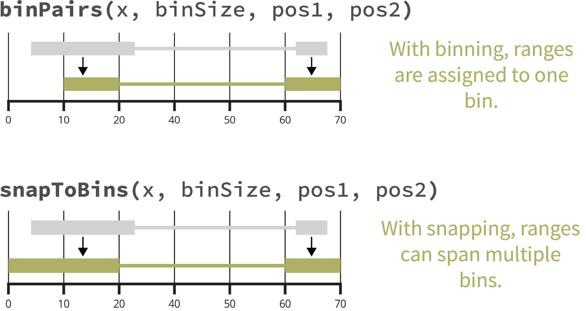

```{r setup, include=FALSE}
knitr::opts_chunk$set(echo = TRUE)
```

# Why mariner?

Disruption or aberrant formation of chromatin interactions can result in
developmental abnormalities and disease. Therefore, deriving biological
insights from 3D chromatin structure experiments, such as Hi-C or Micro-C,
is essential for understanding and correcting human disease.

`mariner` is an R/Bioconductor package for exploring 3D chromatin structure
data from Hi-C or Micro-C experiments. It enables users to flexibly
manipulate, extract, and aggregate chromatin interaction data quickly
and efficiently.

<div class = "row">
<div class = "col-md-4">
**One ecosystem**<br>
`mariner` extends common Bioconductor classes, leveraging the thousands of
existing tools for analyzing and visualizing genomic data.
</div>
  
<div class = "col-md-4">
**Modular design**<br>
`mariner's` functions can be combined and chained in various ways to produce
custom workflows.
</div>
  
<div class = "col-md-4">
**Fast and efficient**<br>
`mariner` leverages HDF5 to store large results and uses block processing
to minimize hardware requirements.
</div>
</div>

# Installation

This package can be installed through Bioconductor:

```{r installPackageBioconductor, eval=FALSE}
if (!require("BiocManager", quietly = TRUE))
    install.packages("BiocManager")
BiocManager::install("mariner")
```

Or the development version can be installed via GitHub:

```{r installPackage, eval=FALSE}
if (!requireNamespace("remotes", quietly = TRUE))
    install.packages("remotes")
remotes::install_github("EricSDavis/mariner")
```

# Key features

## Manipulating Paired Ranges

`mariner` provides helpful functions for converting,
binning, and shifting paired genomic ranges.

### Coercing to and accessing GInteractions

Pairwise interactions between genomic regions are
represented in Bioconductor with the `GInteractions`
class from the `InteractionSet` package.
`mariner` provides additional utilities for
converting BEDPE-formatted data to `GInteractions`
as well as accessing relevant components of these
objects.

```{r as_ginteractions, message=FALSE}
library(mariner)
library(marinerData)

## BEDPE-formatted file
bedpeFile <- marinerData::WT_5kbLoops.txt()

## Read BEDPE
bedpe <- read.table(bedpeFile, header = TRUE)
head(bedpe)

## Coerce to GInteractions
gi <- as_ginteractions(bedpe, keep.extra.columns = FALSE)
gi
```

`mariner` extends `InteractionSet`'s accessors, allowing
users to extract each component of interactions as
vectors.

```{r GInteractionAccessors, results='hold'}
seqnames1(gi) |> head()
start1(gi) |> head()
end1(gi) |> head()
seqnames2(gi) |> head()
start2(gi) |> head()
end2(gi) |> head()
```
### Assigning paired ranges to bins

Chromatin interaction data is usually binned at
specific resolutions. `mariner` provides helpful
functions for assigning `GInteractions` objects
to differently sized bins.

```{r binning1, message=FALSE}
## Assign to 1Kb bins
binned <- assignToBins(x=gi, binSize = 1e3, pos1='center', pos2='center')

## Show that each anchor is 1Kb
library(InteractionSet)
width(binned) |> lapply(unique)

```

<div style="
padding: .5em 1em;
margin-bottom: 10px;
border-radius:5px;
border-left: 5px solid #2780e3;
border-right: 1px solid #dee2e6;
border-top: 1px solid #dee2e6;
border-bottom: 1px solid #dee2e6;
">
<div style="font-weight: 600; opacity: 75%;">
<p style="margin:0px">Note</p>
</div>
`GenomicRanges` and `GInteractions` use ranges that are
1-based while `.hic` are 0-based. For correct downstream
processing with `.hic` files, these functions put ranges
into 0-based bins. This is why the `width` function
returns `binSize + 1`.
</div>

This function also allows each pair, or anchor, to be
binned separately and from different reference points
(e.g. `pos1` and `pos2`).

```{r binning2}
## Assign anchor1 to 1Kb bins and anchor2 to 25Kb bins
binned <- assignToBins(x=gi, binSize=c(1e3, 25e3), pos1="start", pos2="center")

## Show that the first anchor is 1Kb and
## second anchor is 25Kb
width(binned) |> lapply(unique)
```

While `assignToBins()` assigns each pair of ranges
to a single bin, the `snapToBins()` function 
assigns the starts and ends of the ranges to
their nearest bin. This allows each anchor to
span multiple bins.

```{r snapping, results='hold'}
## Create an example GInteractions object
gi <- GInteractions(
    anchor1 = c(
        GRanges("chr1:1-15"),
        GRanges("chr1:1-11")
    ),
    anchor2 = c(
        GRanges("chr1:25-31"),
        GRanges("chr1:19-31")
    )
)

## Original interactions
gi

## Snap to bins with different binSizes
snapToBins(x=gi, binSize=5)
snapToBins(x=gi, binSize=10)
```

The following figure summarizes the differences
between binning and snapping.

```{r binningFigure, fig.align='center', out.width='75%', echo=FALSE}

```

## Clustering & Merging Interactions

Group nearby interactions and select one as representative.

When combining BEDPE files, it is often important to
recognize and reduce duplicate or near duplicate
interactions. `mergePairs()` allows users to cluster
interactions within a specified genomic radius and
select a representative interaction for the group.

This is particularly helpful in analysis of chromatin
loop where multiple Hi-C replicates often identify the
same loop but assign it to a different (but often 
neighboring) pixel. To avoid redundancy, `mergePairs()`
identifies and merges these into a unified non-redundant
loop set.

Here, two example BEDPE files are imported as a list of
`GInteractions` objects.

```{r merging1, message=FALSE}
library(mariner)
library(marinerData)

## BEDPE-formatted files
bedpeFiles <- c(
    marinerData::FS_5kbLoops.txt(),
    marinerData::WT_5kbLoops.txt()
)
names(bedpeFiles) <- c("FS", "WT")

## Read as list of GInteractions
giList <-
    lapply(bedpeFiles, read.table, header=TRUE) |>
    lapply(as_ginteractions)

lapply(giList, summary)
```

Then cluster and merge with `mergePairs()`.

```{r merging2}
mgi <- mergePairs(
    x=giList,
    radius=10e3
)
mgi
```

<div style="
padding: .5em 1em;
margin-bottom: 10px;
border-radius:5px;
border-left: 5px solid #2780e3;
border-right: 1px solid #dee2e6;
border-top: 1px solid #dee2e6;
border-bottom: 1px solid #dee2e6;
">
<div style="font-weight: 600; opacity: 75%;">
<p style="margin:0px">Note</p>
</div>
The metadata is missing from these interactions.
Since no `column` was provided, each interaction
may be an average of one or more interaction.
The user can decide how metadata from each cluster
should be aggregated with `aggMetadata()`.
</div>

The resulting object is `MergedGInteractions` class,
where each of these interactions is a representative
cluster of one or more interactions. This class
behaves like `GInteractions` but contains additional
information about the clustered interactions.

To view the clusters of specific interactions, use
the `clusters()` accessor.

```{r clusters, results='hold'}
mgi[12772]
clusters(mgi[12772])
```

When no `column` argument is provided the most
frequently occurring interaction is selected.
In the pair above, the mean position of both 
anchors is returned since neither is more frequent.

Alternatively, users can specify the `column`
argument to use a custom metric for selecting
a representative interaction.

```{r merging3}
mgi <- mergePairs(
    x=giList,
    radius=10e3,
    column="APScoreAvg",
    selectMax=TRUE
)
mgi
```

The interaction with the higher value (`selectMax=TRUE`)
for "APScoreAvg" has been selected.

```{r clusters2, results='hold'}
mgi[12772]
clusters(mgi[12772])
```

The `sets()` accessor allows users to
find which interactions are shared or exclusive
between sets of interactions in the giList.

```{r sets}
## List the input sources
sources(mgi)

## Interactions unique to each source
sets(mgi) |> lapply(summary)

## Interactions shared by both sources
sets(x=mgi, include=sources(mgi))
```

This is particularly useful for identifying
_de novo_, shared or transient interactions.
For more information see `?sets()`.

## Extracting & Aggregating Interactions

Pull Hi-C pixels or matrices, then aggregate by files or interactions.

`mariner` provides two functions for extracting
contacts from `.hic` files, `pullHicPixels()` and
`pullHicMatrices()`, which use the `binSize`
argument to determine how the data should be returned.
In short, `pullHicPixels()` returns a matrix of
contact frequency for each interaction and `.hic` file,
while `pullHicMatrices()` returns an array of
contact matrices. The following sections describe
when and how to use each of these functions.

### Pulling pixels

Pixels are defined as paired-ranges with widths equal to
their `binSize`. When all interactions are pixels,
`pullHicPixels()` returns an `InteractionMatrix` object
containing a matrix of contact frequency for each
interaction (row) and `.hic` file (column).

As described in previous sections, BEDPE files containing
the locations of chromatin loops can be read in and merged.

```{r examplePullPixels, message=FALSE}
library(mariner)
library(marinerData)

## BEDPE-formatted files
bedpeFiles <- c(
    marinerData::FS_5kbLoops.txt(),
    marinerData::WT_5kbLoops.txt()
)
names(bedpeFiles) <- c("FS", "WT")

## Read as list of GInteractions
giList <-
    lapply(bedpeFiles, read.table, header=TRUE) |>
    lapply(as_ginteractions)

## Merge
mgi <- mergePairs(x=giList, radius=10e3, column="APScoreAvg")

summary(mgi)
```

The `marinerData` `ExperimentHub` package includes some
small `.hic` files that can be downloaded for testing.

```{r loadHicFiles, message=FALSE}
library(marinerData)
hicFiles <- c(
    LEUK_HEK_PJA27_inter_30.hic(),
    LEUK_HEK_PJA30_inter_30.hic()
)
names(hicFiles) <- c("FS", "WT")
hicFiles
```

The `strawr` package includes functions for visualizing
the available chromosomes, resolutions (`binSizes`), and
normalizations in the `.hic` files.

```{r strawr}
library(strawr)

## Normalizations
lapply(hicFiles, readHicNormTypes)

## Resolutions
lapply(hicFiles, readHicBpResolutions)

## Chromosomes
lapply(hicFiles, readHicChroms) |>
    lapply(head)
```

Since the chromosomes in the `.hic` files have been
processed without the "chr" prefix, it is important
to change the `seqLevelsStyle` of the interactions
to match.

```{r seqLevelStyles}
GenomeInfoDb::seqlevelsStyle(mgi) <- 'ENSEMBL'
```


These interactions can then be binned to the desired
resolution with the `assignToBins()` function.

```{r binPixels}
## Assign interactions to 100Kb bins
binned <- assignToBins(x=mgi, binSize=100e3)
```

Contact frequency can then be extracted with
`pullHicPixels()`. Here only the first 1000
pixels are pulled for demonstration purposes.

```{r pullPixels}
imat <- pullHicPixels(
    x=binned[1:1000],
    files=hicFiles,
    binSize=100e3
)
imat
```
<div style="
padding: .5em 1em;
margin-bottom: 10px;
border-radius:5px;
border-left: 5px solid #2780e3;
border-right: 1px solid #dee2e6;
border-top: 1px solid #dee2e6;
border-bottom: 1px solid #dee2e6;
">
<div style="font-weight: 600; opacity: 75%;">
<p style="margin:0px">Note</p>
</div>
There are many parameters in the `pullHicPixels()`
function. Users can change the normalization, the
type of matrix pulled (e.g. "observed" vs "expected"),
and where/how the on-disk data is stored. Users can
also decrease the amount of data read into memory
by decreasing the `blockSize`. For more information
see `?pullHicPixels()` or `?pullHicMatrices()`.
</div>

The count matrix can be extracted from the
`InteractionMatrix` class with the `counts()`
function.

```{r}
counts(imat)
```

<div style="
padding: .5em 1em;
margin-bottom: 10px;
border-radius:5px;
border-left: 5px solid #2780e3;
border-right: 1px solid #dee2e6;
border-top: 1px solid #dee2e6;
border-bottom: 1px solid #dee2e6;
">
<div style="font-weight: 600; opacity: 75%;">
<p style="margin:0px">Note</p>
</div>
The `InteractionMatrix` class extends `InteractionSet` and
`SummarizedExperiment` classes. See the documentation for
these classes for instructions on how to extract different
parts of the `InteractionMatrix` object.
</div>

### Pulling submatrices

When the widths of paired-ranges are greater than
the `binSize`, `pullHicMatrices()` returns an
`InteractionArray` object containing an array of
contact matrices for each interaction and `.hic`
file.

Using the example above, reducing the `binSize` to 25Kb
when the data is binned at 100Kb results in 4x4 count matrices
for each interaction instead of a single value.

```{r, pullMatrices1}
iarr <- pullHicMatrices(
    x=binned[1:1000],
    file=hicFiles,
    binSize = 25e3
)
iarr
```

This results in an `InteractionArray` with 1000
interactions, each with 4x4 count matrices
across 2 `.hic` files. These data can be accessed
with the same `counts()` accessor.

```{r}
counts(iarr)
```

The start bins for each interaction can be
shown by setting `showDimnames=TRUE`.

```{r}
counts(iarr, showDimnames=TRUE)
```

<div style="
padding: .5em 1em;
margin-bottom: 10px;
border-radius:5px;
border-left: 5px solid #2780e3;
border-right: 1px solid #dee2e6;
border-top: 1px solid #dee2e6;
border-bottom: 1px solid #dee2e6;
">
<div style="font-weight: 600; opacity: 75%;">
<p style="margin:0px">Note</p>
</div>
These functions utilize the `DelayedArray` and `HDF5Array`
framework to efficiently store extracted data on-disk,
freeing up RAM, and allowing users to work with large
contact data seamlessly.
</div>

The `pixelsToMatrices()` function helps prepare regions
surrounding a central pixel. For example, the code below
shows how to pull 3x3 matrices surrounding a 100Kb pixel.

```{r pullMatrices2}
## Define region with 1-pixel buffer
regions <- pixelsToMatrices(x=binned[1:1000], buffer=1)

## Pull 3x3 matrices from 1000 interactions and 2 hic files
iarr <- pullHicMatrices(
    x=regions,
    files=hicFiles,
    binSize=100e3
)

## See count matrices
counts(iarr)
```

This also works on rectangular selections.

```{r pullMatrices3}

## Bin at two different resolutions
binned <- assignToBins(x=mgi, binSize=c(100e3, 250e3))

## Pull 10x25 matrices from 1000 interactions and 2 hic files
iarr2 <- pullHicMatrices(
    x=binned[1:1000],
    files=hicFiles,
    binSize=10e3
)

## See count matrices
counts(iarr2)
```

### Aggregating count matrices

The `aggHicMatrices()` function allows flexible
aggregation of `InteractionArray` objects by 
interactions, Hi-C files, or both (default).
The `FUN` argument controls how these contacts
should be aggregated (the default is `sum`).

```{r aggHic}
## One matrix per interaction
aggHicMatrices(x=iarr, by="interactions")

## One matrix per file
aggHicMatrices(x=iarr, by="files")

## One matrix total
aggHicMatrices(x=iarr)
```

<div style="
padding: .5em 1em;
margin-bottom: 10px;
border-radius:5px;
border-left: 5px solid #2780e3;
border-right: 1px solid #dee2e6;
border-top: 1px solid #dee2e6;
border-bottom: 1px solid #dee2e6;
">
<div style="font-weight: 600; opacity: 75%;">
<p style="margin:0px">Note</p>
</div>
The `aggHicMatrices()` function uses block processing
to operate on the `DelayedArray` count matrices.
The `nBlocks` argument controls how many blocks the
data should be split into for processing. This can
be conducted in parallel by setting `BPPARAM`. See
`?aggHicMatrices()` for more information.
</div>

### Visualizing aggregated matrices

`mariner` provides the `plotMatrix()` function for
visualizing the aggregated `.hic` matrices, such as
in an aggregate peak analysis.

```{r plotMatrix}
mat <- aggHicMatrices(x=iarr)
plotMatrix(data=mat)
```

This function is compatible with `plotgardener`,
an R/Bioconductor genomic visualization package. 
`plotgardener` gives precise control over the
size and placement of plots on a page, making
it suitable for complex, publication-ready figure
building. For more information about `plotgardener`
visit https://phanstiellab.github.io/plotgardener/.


## Calculating Loop Enrichment

Determine loop enrichment to local background with
_selection functions_ to flexibility select foreground
and background.

The `calcLoopEnrichment()` function combines many of
the steps described in the previous sections into
a single function that pulls Hi-C pixels and
calculates the enrichment of a selected _foreground_
compared to a selected _background_.

`mariner` provides several different selection functions
for easily and flexibly selecting different parts of
a matrix. The code below shows a few examples of how
these functions can be used and combined to select
virtually any part of a square matrix.

```{r selectionFunctions}
## Define the buffer
buffer <- 3

## Select center pixel
selectCenterPixel(mhDist=0, buffer=buffer)

## With a radial distance
selectCenterPixel(mhDist=0:1, buffer=buffer)

## Select all corners
selectCorners(n=2, buffer=buffer)

## Combine functions
selectTopLeft(n=2, buffer=buffer) +
    selectBottomRight(n=2, buffer=buffer)
```

These selection functions can be passed into
`calcLoopEnrichment()` along with a `GInteractions`
object defining the loop pixels to calculate
enrichment for each `.hic` file.

```{r loopEnrichment, message=FALSE}
library(mariner)
library(marinerData)

## Define hicFiles
hicFiles <- c(
    LEUK_HEK_PJA27_inter_30.hic(),
    LEUK_HEK_PJA30_inter_30.hic()
) |> setNames(c("FS", "WT"))

## Read in loops
loops <- 
    WT_5kbLoops.txt() |>
    setNames("WT") |>
    read.table(header=TRUE, nrows=1000) |>
    as_ginteractions() |>
    assignToBins(binSize=100e3) |>
    GenomeInfoDb::`seqlevelsStyle<-`('ENSEMBL')

## Define foreground & background
buffer <- 10
fg <- selectCenterPixel(mhDist=0:1, buffer=buffer)
bg <- selectTopLeft(n=2, buffer=buffer) +
    selectBottomRight(n=2, buffer=buffer)

## Calculate loop enrichment
enrich <- calcLoopEnrichment(
    x=loops,
    files=hicFiles,
    fg=fg,
    bg=bg
)
enrich
```

This results in a `DelayedMatrix` with rows
for each interaction and columns corresponding to
each `.hic` file.

# Session Info

```{r}
sessionInfo()
```
